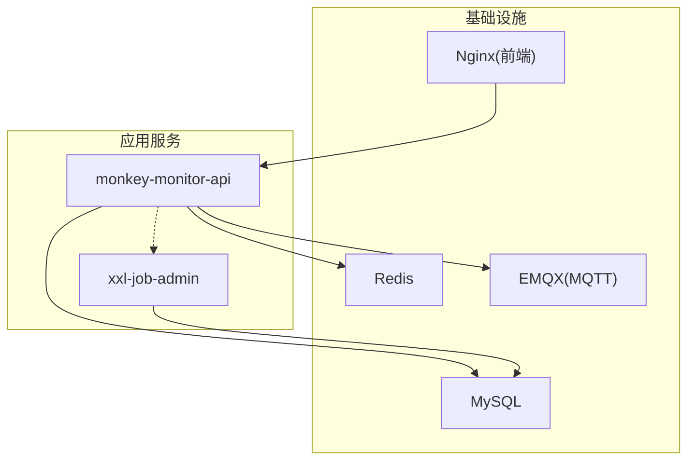
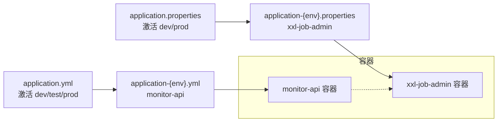
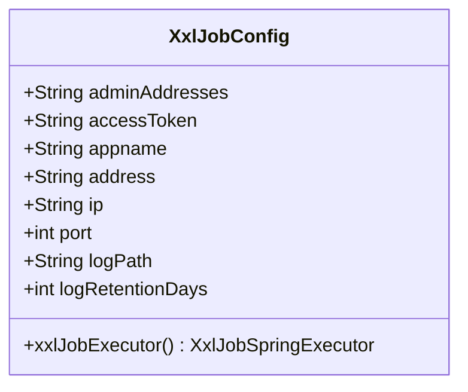
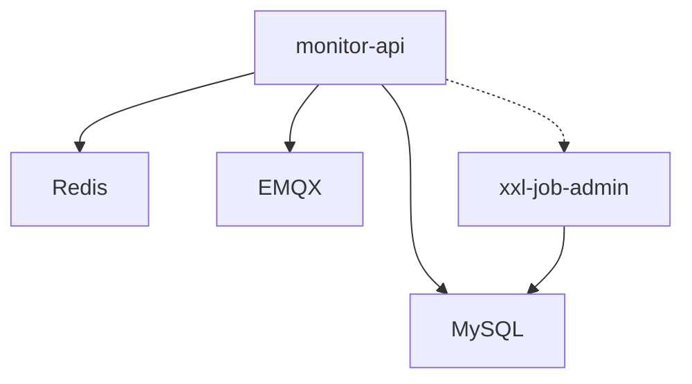

# 环境配置

<cite>
**本文引用的文件**   
- [deploy/config/monitor-api/application-prod.yml](file://deploy/config/monitor-api/application-prod.yml)
- [deploy/config/xxl-job-admin/application-prod.properties](file://deploy/config/xxl-job-admin/application-prod.properties)
- [monkey-monitor-api/src/main/resources/application.yml](file://monkey-monitor-api/src/main/resources/application.yml)
- [monkey-monitor-api/src/main/resources/application-dev.yml](file://monkey-monitor-api/src/main/resources/application-dev.yml)
- [monkey-monitor-api/src/main/resources/application-test.yml](file://monkey-monitor-api/src/main/resources/application-test.yml)
- [xxl-job-admin/src/main/resources/application.properties](file://xxl-job-admin/src/main/resources/application.properties)
- [xxl-job-admin/src/main/resources/application-dev.properties](file://xxl-job-admin/src/main/resources/application-dev.properties)
- [xxl-job-admin/src/main/resources/application-prod.properties](file://xxl-job-admin/src/main/resources/application-prod.properties)
- [deploy/docker-compose.yml](file://deploy/docker-compose.yml)
- [deploy/build-push.ps1](file://deploy/build-push.ps1)
- [deploy/pull-images.ps1](file://deploy/pull-images.ps1)
- [deploy/.gitignore](file://deploy/.gitignore)
- [monkey-monitor-api/src/main/java/com/monkey/general/config/XxlJobConfig.java](file://monkey-monitor-api/src/main/java/com/monkey/general/config/XxlJobConfig.java)
- [monkey-monitor-api/src/main/java/com/monkey/general/config/CompanyCodeCheckConfig.java](file://monkey-monitor-api/src/main/java/com/monkey/general/config/CompanyCodeCheckConfig.java)
</cite>

## 目录
1. [简介](#简介)
2. [项目结构](#项目结构)
3. [核心组件与配置概览](#核心组件与配置概览)
4. [架构总览](#架构总览)
5. [详细组件分析](#详细组件分析)
6. [依赖关系分析](#依赖关系分析)
7. [性能与稳定性考量](#性能与稳定性考量)
8. [故障排查指南](#故障排查指南)
9. [结论](#结论)
10. [附录](#附录)

## 简介
本文件面向安威 fireworks 物联网监控平台的运维与开发团队，系统性梳理生产环境配置文件的结构与参数含义，覆盖数据库、缓存、MQTT、XXL-Job 等关键组件，并给出开发/测试/生产三类环境的差异对比、动态加载与热更新机制说明、环境变量使用与管理策略、配置验证与测试方法、安全最佳实践以及配置变更的审批与回滚建议。

## 项目结构
平台采用多模块与容器编排结合的方式组织，核心服务包括：
- 应用服务：monitor-api（监控 API）、xxl-job-admin（任务调度管理）
- 基础设施：MySQL（持久化）、Redis（缓存）、EMQX（MQTT Broker）、Nginx（前端）
- 编排与镜像：docker-compose、构建与推送脚本

图表来源
- [deploy/docker-compose.yml:1-103](file://deploy/docker-compose.yml#L1-L103)

章节来源
- [deploy/docker-compose.yml:1-103](file://deploy/docker-compose.yml#L1-L103)

## 核心组件与配置概览
- 环境激活与基础配置
  - monitor-api 的环境激活由 application.yml 指定，支持 dev/test/prod 三套 profile 配置文件。
  - xxl-job-admin 的环境激活由其 application.properties 指定，同样提供 dev/prod 两套属性文件。
- 生产配置文件
  - monitor-api 生产配置位于 deploy/config/monitor-api/application-prod.yml，集中定义数据库、缓存、MQTT、XXL-Job、第三方集成等生产所需参数。
  - xxl-job-admin 生产配置位于 deploy/config/xxl-job-admin/application-prod.properties，集中定义数据库、连接池、邮件、令牌、国际化、日志保留等。
- 容器挂载与环境变量
  - docker-compose 将上述配置文件以只读卷方式挂载至容器内对应路径，同时通过环境变量注入敏感信息（如数据库密码、MQTT 访问凭据等）。

章节来源
- [monkey-monitor-api/src/main/resources/application.yml:1-40](file://monkey-monitor-api/src/main/resources/application.yml#L1-L40)
- [xxl-job-admin/src/main/resources/application.properties:1-3](file://xxl-job-admin/src/main/resources/application.properties#L1-L3)
- [deploy/config/monitor-api/application-prod.yml:1-203](file://deploy/config/monitor-api/application-prod.yml#L1-L203)
- [deploy/config/xxl-job-admin/application-prod.properties:1-66](file://deploy/config/xxl-job-admin/application-prod.properties#L1-L66)
- [deploy/docker-compose.yml:1-103](file://deploy/docker-compose.yml#L1-L103)

## 架构总览
下图展示配置在系统中的加载与交互关系：

图表来源
- [monkey-monitor-api/src/main/resources/application.yml:1-40](file://monkey-monitor-api/src/main/resources/application.yml#L1-L40)
- [xxl-job-admin/src/main/resources/application.properties:1-3](file://xxl-job-admin/src/main/resources/application.properties#L1-L3)
- [deploy/config/monitor-api/application-prod.yml:1-203](file://deploy/config/monitor-api/application-prod.yml#L1-L203)
- [deploy/config/xxl-job-admin/application-prod.properties:1-66](file://deploy/config/xxl-job-admin/application-prod.properties#L1-L66)

## 详细组件分析

### 数据库连接配置
- monitor-api（Spring Boot）
  - 数据源驱动、URL、用户名、密码均通过 application-{env}.yml 注入，生产环境使用 MySQL 8.0。
  - Hikari 连接池参数（最小空闲、最大连接、超时等）在生产配置中明确设置。
- xxl-job-admin（Spring Boot）
  - 数据源驱动、URL、用户名、密码通过 application-{env}.properties 注入。
  - Hikari 连接池参数与健康检查查询语句在生产配置中明确设置。

章节来源
- [deploy/config/monitor-api/application-prod.yml:4-15](file://deploy/config/monitor-api/application-prod.yml#L4-L15)
- [deploy/config/monitor-api/application-prod.yml:10-15](file://deploy/config/monitor-api/application-prod.yml#L10-L15)
- [deploy/config/xxl-job-admin/application-prod.properties:25-41](file://deploy/config/xxl-job-admin/application-prod.properties#L25-L41)

### 缓存配置（Redis）
- monitor-api（Spring Boot）
  - 开关、数据库索引、主机、端口、密码、超时、连接池上限/等待/空闲等参数在 application-{env}.yml 中集中配置。
  - 生产配置中默认关闭 Redis 缓存开关，避免在未启用时产生额外开销。
- xxl-job-admin（Spring Boot）
  - 未见独立 Redis 配置项，主要依赖 MySQL 与 Hikari。

章节来源
- [deploy/config/monitor-api/application-prod.yml:14-26](file://deploy/config/monitor-api/application-prod.yml#L14-L26)

### MQTT 配置
- monitor-api（Spring Boot）
  - 本地接口返回给外部设备的 MQTT 地址、用户名、密码、clientId、超时、保活等参数在 application-{env}.yml 中集中配置。
  - 传感器数据接收连接参数与主题订阅规则也在此文件中定义。
- xxl-job-admin（Spring Boot）
  - 未见 MQTT 相关配置。

章节来源
- [deploy/config/monitor-api/application-prod.yml:30-58](file://deploy/config/monitor-api/application-prod.yml#L30-L58)

### XXL-Job 配置
- monitor-api（Spring Boot）
  - 通过 XxlJobConfig 注解类加载配置，关键参数包括调度中心地址、令牌、执行器名称、注册地址/IP/端口、日志路径与保留天数。
- xxl-job-admin（Spring Boot）
  - 通过 application-{env}.properties 配置调度中心、令牌、国际化、线程池大小、日志保留天数等。

图表来源
- [monkey-monitor-api/src/main/java/com/monkey/general/config/XxlJobConfig.java:1-78](file://monkey-monitor-api/src/main/java/com/monkey/general/config/XxlJobConfig.java#L1-L78)

章节来源
- [monkey-monitor-api/src/main/java/com/monkey/general/config/XxlJobConfig.java:1-78](file://monkey-monitor-api/src/main/java/com/monkey/general/config/XxlJobConfig.java#L1-L78)
- [deploy/config/monitor-api/application-prod.yml:116-135](file://deploy/config/monitor-api/application-prod.yml#L116-L135)
- [deploy/config/xxl-job-admin/application-prod.properties:54-66](file://deploy/config/xxl-job-admin/application-prod.properties#L54-L66)

### 第三方集成与业务配置
- 数据同步服务地址、公司编码/名称、Swagger 开关、文件上传路径、语音播报重复次数、JT808 端口等参数在 monitor-api 的 application-{env}.yml 中集中配置。
- 各省/区域上报参数（如云南、广西、贵州）、IP 音响、大华 SDK、四相人员定位等按需启用或禁用。

章节来源
- [deploy/config/monitor-api/application-prod.yml:83-203](file://deploy/config/monitor-api/application-prod.yml#L83-L203)

### 不同环境配置差异对比
- monitor-api
  - dev：数据库、Redis、MQTT 主机指向开发/测试地址，XXL-Job 执行器端口与日志路径适配本地调试。
  - test：数据库、Redis、MQTT 主机指向测试环境，文件上传与访问域名指向测试服务。
  - prod：数据库、Redis、MQTT 主机指向生产服务名或外网可达地址，XXL-Job 执行器端口与日志路径指向生产目录。
- xxl-job-admin
  - dev：端口与数据库连接指向本地或测试实例。
  - prod：端口与数据库连接指向生产实例，令牌、国际化、日志保留天数等按生产要求配置。

章节来源
- [monkey-monitor-api/src/main/resources/application-dev.yml:1-206](file://monkey-monitor-api/src/main/resources/application-dev.yml#L1-L206)
- [monkey-monitor-api/src/main/resources/application-test.yml:1-76](file://monkey-monitor-api/src/main/resources/application-test.yml#L1-L76)
- [monkey-monitor-api/src/main/resources/application-prod.yml:1-203](file://deploy/config/monitor-api/application-prod.yml#L1-L203)
- [xxl-job-admin/src/main/resources/application-dev.properties:1-55](file://xxl-job-admin/src/main/resources/application-dev.properties#L1-L55)
- [xxl-job-admin/src/main/resources/application-prod.properties:1-66](file://xxl-job-admin/src/main/resources/application-prod.properties#L1-L66)

### 配置动态加载与热更新机制
- Spring Profile 激活
  - monitor-api 通过 application.yml 指定当前激活的 profile（dev/test/prod），各模块的 application-{env}.yml 文件按环境加载。
- 容器挂载与重启
  - docker-compose 将宿主机上的配置文件以只读卷挂载到容器内对应路径，修改宿主机配置后需重启容器以使新配置生效。
- 环境变量注入
  - docker-compose 使用环境变量注入敏感信息（如数据库 root 密码、EMQX 控制台账号密码），避免明文写入配置文件。
- 热更新建议
  - 对于无状态配置（如日志级别、业务开关），可在应用层实现条件刷新或通过外部配置中心（如 Nacos/Consul）进行动态下发与监听。
  - 对于数据库/缓存/MQTT 等连接参数，建议通过滚动升级与健康检查确保平滑切换。

章节来源
- [monkey-monitor-api/src/main/resources/application.yml:4-7](file://monkey-monitor-api/src/main/resources/application.yml#L4-L7)
- [deploy/docker-compose.yml:10-13](file://deploy/docker-compose.yml#L10-L13)
- [deploy/docker-compose.yml:37-39](file://deploy/docker-compose.yml#L37-L39)
- [deploy/docker-compose.yml:63-64](file://deploy/docker-compose.yml#L63-L64)
- [deploy/docker-compose.yml:79-79](file://deploy/docker-compose.yml#L79-L79)

### 环境变量使用与管理策略
- 敏感信息
  - MySQL root 密码、EMQX 控制台账号密码通过环境变量注入，不在仓库中留存。
- 非敏感信息
  - 镜像版本、服务端口、静态资源路径等可通过环境变量统一管理，便于多环境一致性。
- 管理建议
  - 使用 .env 文件集中管理环境变量，但将其加入 .gitignore，避免误提交。
  - 在 CI/CD 中通过密钥管理服务注入敏感变量，避免硬编码。

章节来源
- [deploy/.gitignore:1-8](file://deploy/.gitignore#L1-L8)
- [deploy/docker-compose.yml:10-13](file://deploy/docker-compose.yml#L10-L13)
- [deploy/docker-compose.yml:37-39](file://deploy/docker-compose.yml#L37-L39)

### 配置验证与测试方法
- 启动前校验
  - 企业编码校验：若未配置或仍为占位值，应用将记录错误并优雅退出，防止误启动。
- 连通性测试
  - 数据库：通过 Hikari 连接池健康检查与 SQL 查询验证连通性。
  - 缓存：通过缓存操作验证 Redis 连接与权限。
  - MQTT：通过订阅/发布测试连接与鉴权。
  - XXL-Job：通过执行器注册与心跳上报验证调度中心连通性。
- 日志与指标
  - 关注启动日志中的配置加载信息与连接建立日志，必要时开启更详细的日志级别辅助诊断。

章节来源
- [monkey-monitor-api/src/main/java/com/monkey/general/config/CompanyCodeCheckConfig.java:27-43](file://monkey-monitor-api/src/main/java/com/monkey/general/config/CompanyCodeCheckConfig.java#L27-L43)
- [deploy/config/monitor-api/application-prod.yml:4-15](file://deploy/config/monitor-api/application-prod.yml#L4-L15)
- [deploy/config/monitor-api/application-prod.yml:14-26](file://deploy/config/monitor-api/application-prod.yml#L14-L26)
- [deploy/config/monitor-api/application-prod.yml:30-58](file://deploy/config/monitor-api/application-prod.yml#L30-L58)
- [deploy/config/monitor-api/application-prod.yml:116-135](file://deploy/config/monitor-api/application-prod.yml#L116-L135)

### 配置安全最佳实践与敏感信息保护
- 最小暴露原则
  - 仅在必要范围内开放端口与服务发现，MQTT/HTTP 端口避免对外全网暴露。
- 凭据管理
  - 使用环境变量注入数据库与 MQTT 凭据，避免明文配置文件。
  - 对第三方 API 密钥与证书进行加密存储与轮换。
- 配置审计
  - 对配置变更进行记录与审批，变更前后进行回归测试。
- 网络隔离
  - 基础设施与应用服务置于独立网络，限制跨服务访问。

章节来源
- [deploy/docker-compose.yml:10-13](file://deploy/docker-compose.yml#L10-L13)
- [deploy/docker-compose.yml:37-39](file://deploy/docker-compose.yml#L37-L39)
- [deploy/.gitignore:1-8](file://deploy/.gitignore#L1-L8)

### 配置变更的审批流程与回滚策略
- 审批流程
  - 变更需求 → 配置评审 → CI/CD 触发 → 预生产验证 → 上线审批 → 发布 → 观察与告警。
- 回滚策略
  - 采用蓝绿/金丝雀发布，保留上一版本镜像与配置，出现异常时快速回滚。
  - 若为配置文件变更，先恢复挂载卷中的旧配置，再滚动重启容器，确保最小影响面。

章节来源
- [deploy/build-push.ps1:1-263](file://deploy/build-push.ps1#L1-L263)
- [deploy/pull-images.ps1:1-56](file://deploy/pull-images.ps1#L1-L56)

## 依赖关系分析
- monitor-api 依赖 MySQL、Redis、EMQX；与 xxl-job-admin 通过调度中心地址建立通信。
- xxl-job-admin 依赖 MySQL 与 Hikari 连接池。
- docker-compose 将宿主机配置卷挂载至容器，实现配置与代码解耦。

图表来源
- [deploy/docker-compose.yml:6-24](file://deploy/docker-compose.yml#L6-L24)
- [deploy/docker-compose.yml:56-87](file://deploy/docker-compose.yml#L56-L87)
- [deploy/config/monitor-api/application-prod.yml:4-15](file://deploy/config/monitor-api/application-prod.yml#L4-L15)
- [deploy/config/monitor-api/application-prod.yml:14-26](file://deploy/config/monitor-api/application-prod.yml#L14-L26)
- [deploy/config/monitor-api/application-prod.yml:30-58](file://deploy/config/monitor-api/application-prod.yml#L30-L58)
- [deploy/config/xxl-job-admin/application-prod.properties:25-41](file://deploy/config/xxl-job-admin/application-prod.properties#L25-L41)

章节来源
- [deploy/docker-compose.yml:1-103](file://deploy/docker-compose.yml#L1-L103)

## 性能与稳定性考量
- 连接池与超时
  - 合理设置数据库连接池大小与超时阈值，避免高并发下的连接争用与堆积。
- 缓存策略
  - 在生产环境默认关闭 Redis 缓存时，需评估热点数据的内存命中率与数据库压力。
- MQTT 并发与主题
  - 控制订阅主题粒度与并发消费者数量，避免消息风暴导致的延迟与丢包。
- 日志与监控
  - 启用必要的指标采集与日志聚合，结合告警策略实现快速响应。

## 故障排查指南
- 启动失败
  - 检查企业编码是否正确配置且非占位值，查看启动日志中的错误提示。
- 连接失败
  - 核对数据库/Redis/MQTT 的主机、端口、凭据与网络连通性。
- 配置未生效
  - 确认 docker-compose 卷挂载路径与容器内配置文件路径一致，修改后重启容器。
- XXL-Job 无法注册
  - 校验调度中心地址、令牌、执行器端口与日志路径，确认网络可达与权限正确。

章节来源
- [monkey-monitor-api/src/main/java/com/monkey/general/config/CompanyCodeCheckConfig.java:27-43](file://monkey-monitor-api/src/main/java/com/monkey/general/config/CompanyCodeCheckConfig.java#L27-L43)
- [deploy/docker-compose.yml:79-81](file://deploy/docker-compose.yml#L79-L81)

## 结论
本文系统梳理了安威 fireworks 物联网监控平台的环境配置，明确了生产配置文件的结构与关键参数，给出了不同环境的差异对比与管理策略，并提出了动态加载与热更新、安全与审计、变更审批与回滚的实践建议。建议在后续运维中持续完善配置中心与自动化巡检能力，提升配置治理水平与系统稳定性。

## 附录
- 配置文件路径与用途
  - monitor-api 生产配置：deploy/config/monitor-api/application-prod.yml
  - xxl-job-admin 生产配置：deploy/config/xxl-job-admin/application-prod.properties
  - monitor-api 环境激活：monkey-monitor-api/src/main/resources/application.yml
  - xxl-job-admin 环境激活：xxl-job-admin/src/main/resources/application.properties
- 容器编排与镜像
  - docker-compose：deploy/docker-compose.yml
  - 构建与推送：deploy/build-push.ps1
  - 拉取镜像：deploy/pull-images.ps1
- 安全与审计
  - .gitignore：deploy/.gitignore