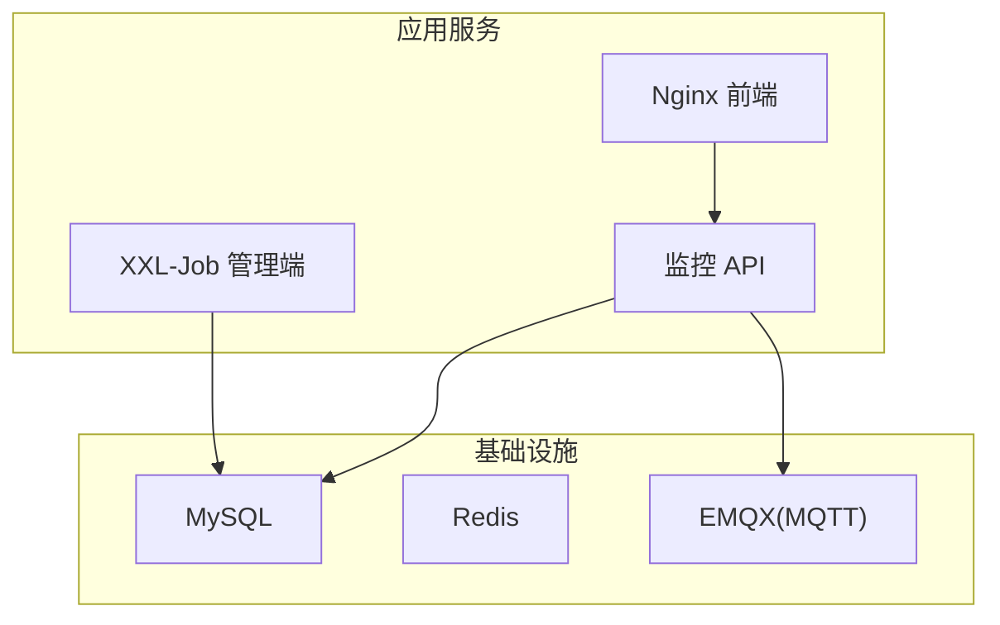
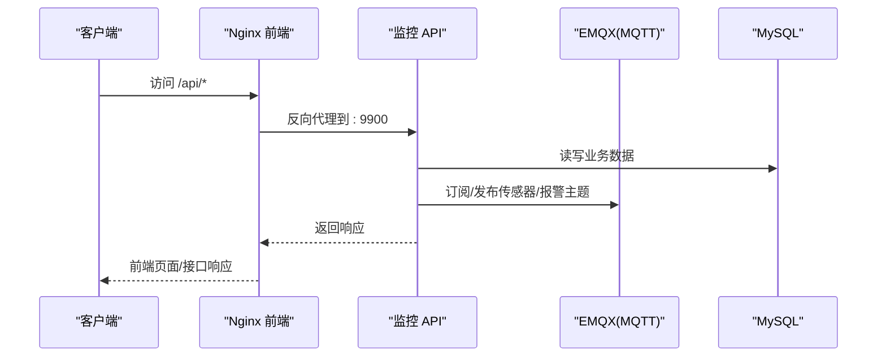
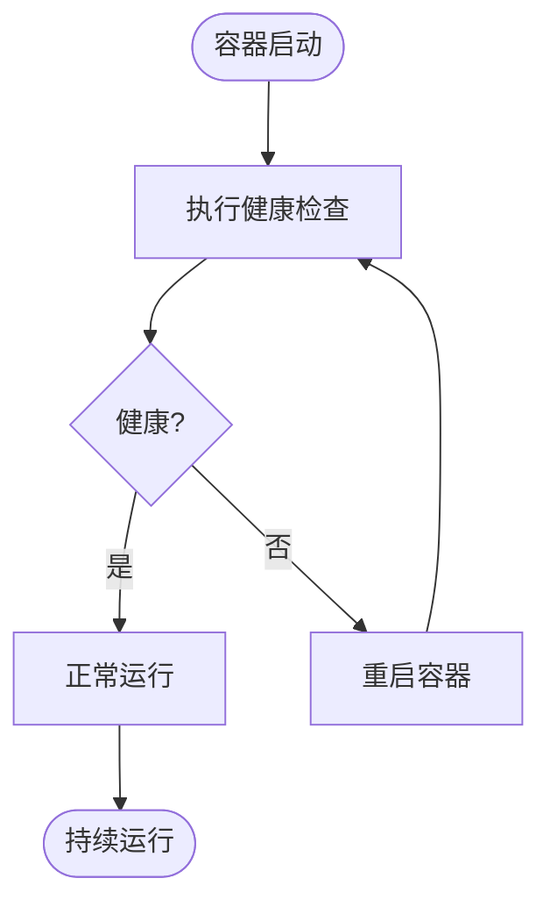
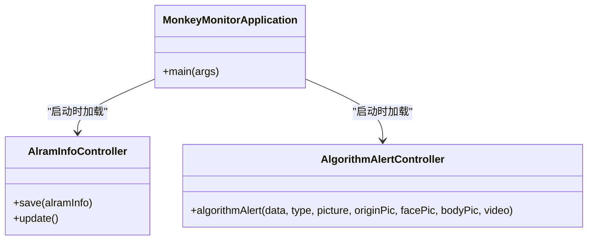
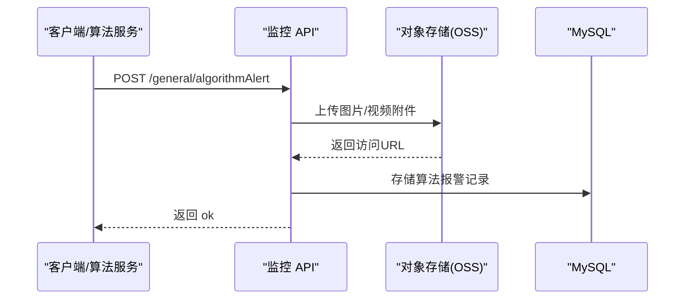
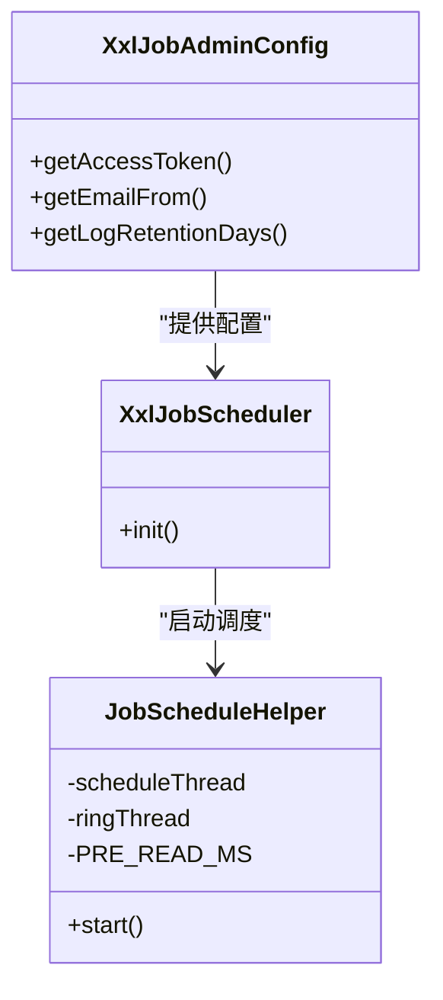
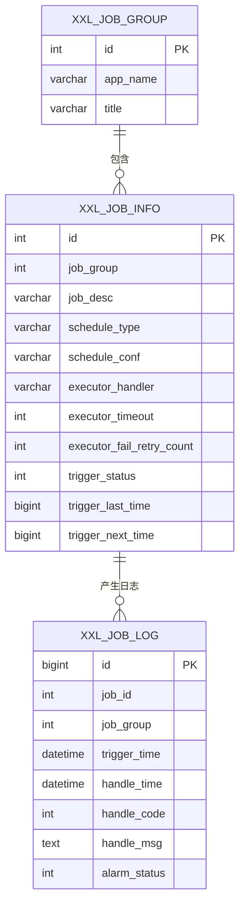
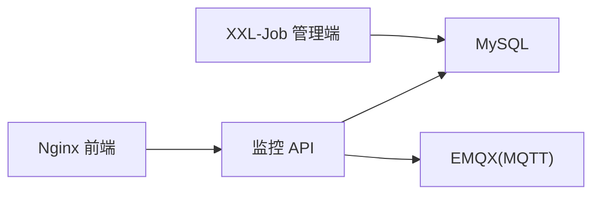

# 监控告警

<cite>
**本文引用的文件**
- [docker-compose.yml](file://deploy/docker-compose.yml)
- [application-prod.yml（监控 API）](file://deploy/config/monitor-api/application-prod.yml)
- [application-prod.yml（XXL-Job 管理端）](file://deploy/config/xxl-job-admin/application-prod.properties)
- [nginx.conf（前端）](file://deploy/config/frontend/nginx.conf)
- [init.sql（初始化脚本）](file://deploy/init/init.sql)
- [MonkeyMonitorApplication.java](file://monkey-monitor-api/src/main/java/com/monkey/general/MonkeyMonitorApplication.java)
- [AlramInfoController.java](file://monkey-monitor-api/src/main/java/com/monkey/general/controller/AlramInfoController.java)
- [AlgorithmAlertController.java](file://monkey-monitor-api/src/main/java/com/monkey/general/controller/AlgorithmAlertController.java)
- [GetAlgorithmAlarm.java](file://monkey-monitor-api/src/main/java/com/monkey/general/python/GetAlgorithmAlarm.java)
- [XxlJobScheduler.java](file://xxl-job-admin/src/main/java/com/xxl/job/admin/core/scheduler/XxlJobScheduler.java)
- [JobScheduleHelper.java](file://xxl-job-admin/src/main/java/com/xxl/job/admin/core/thread/JobScheduleHelper.java)
- [XxlJobAdminConfig.java](file://xxl-job-admin/src/main/java/com/xxl/job/admin/core/conf/XxlJobAdminConfig.java)
</cite>

## 目录
1. [简介](#简介)
2. [项目结构](#项目结构)
3. [核心组件](#核心组件)
4. [架构总览](#架构总览)
5. [详细组件分析](#详细组件分析)
6. [依赖关系分析](#依赖关系分析)
7. [性能考量](#性能考量)
8. [故障排查指南](#故障排查指南)
9. [结论](#结论)
10. [附录](#附录)

## 简介
本文件面向安威 fireworks 物联网监控平台，提供一套完整的监控与告警体系文档，覆盖系统健康检查、服务可用性与资源使用率监控、业务指标监控、容器健康检查与自愈、性能指标与阈值建议、告警规则与通知机制、日志聚合与分析、监控仪表板搭建、监控数据存储与保留策略、故障预警与预防性维护最佳实践，以及监控系统的扩展与定制方法。

## 项目结构
平台采用容器化编排，核心服务包括：
- 基础设施：MySQL、Redis、EMQX（MQTT）
- 应用服务：XXL-Job 管理端、监控 API、前端 Nginx
- 配置与初始化：各服务生产配置、初始化 SQL

图表来源
- [docker-compose.yml:1-103](file://deploy/docker-compose.yml#L1-L103)
- [application-prod.yml（监控 API）:1-203](file://deploy/config/monitor-api/application-prod.yml#L1-L203)
- [application-prod.yml（XXL-Job 管理端）:1-66](file://deploy/config/xxl-job-admin/application-prod.properties#L1-L66)

章节来源
- [docker-compose.yml:1-103](file://deploy/docker-compose.yml#L1-L103)
- [application-prod.yml（监控 API）:1-203](file://deploy/config/monitor-api/application-prod.yml#L1-L203)
- [application-prod.yml（XXL-Job 管理端）:1-66](file://deploy/config/xxl-job-admin/application-prod.properties#L1-L66)

## 核心组件
- 监控 API：负责报警数据接入、存储、业务指标计算与对外接口（含算法报警与常规报警）。
- XXL-Job 管理端：负责定时任务调度、执行器注册、失败与丢失监控、日志报表与保留策略。
- 基础设施：MySQL 提供持久化，Redis 可选缓存，EMQX 提供 MQTT 通道。
- 前端 Nginx：反向代理到监控 API，统一入口。

章节来源
- [AlramInfoController.java:1-73](file://monkey-monitor-api/src/main/java/com/monkey/general/controller/AlramInfoController.java#L1-L73)
- [AlgorithmAlertController.java:1-68](file://monkey-monitor-api/src/main/java/com/monkey/general/controller/AlgorithmAlertController.java#L1-L68)
- [XxlJobScheduler.java:1-44](file://xxl-job-admin/src/main/java/com/xxl/job/admin/core/scheduler/XxlJobScheduler.java#L1-L44)

## 架构总览
平台通过 docker-compose 编排，监控 API 与 XXL-Job 管理端分别依赖 MySQL 与 EMQX。前端 Nginx 将请求转发至监控 API。系统具备容器健康检查与自愈能力（容器重启策略），并内置定时任务用于数据同步与报警处理。

图表来源
- [nginx.conf（前端）:1-24](file://deploy/config/frontend/nginx.conf#L1-L24)
- [application-prod.yml（监控 API）:30-60](file://deploy/config/monitor-api/application-prod.yml#L30-L60)
- [docker-compose.yml:71-87](file://deploy/docker-compose.yml#L71-L87)

## 详细组件分析

### 容器健康检查与自愈
- MySQL、EMQX、XXL-Job 管理端、监控 API 均配置了健康检查与重启策略，确保服务异常时自动恢复。
- 依赖关系：监控 API 依赖 MySQL 与 EMQX 健康；XXL-Job 管理端依赖 MySQL 健康。

图表来源
- [docker-compose.yml:17-22](file://deploy/docker-compose.yml#L17-L22)
- [docker-compose.yml:45-50](file://deploy/docker-compose.yml#L45-L50)
- [docker-compose.yml:65-67](file://deploy/docker-compose.yml#L65-L67)
- [docker-compose.yml:81-85](file://deploy/docker-compose.yml#L81-L85)

章节来源
- [docker-compose.yml:17-22](file://deploy/docker-compose.yml#L17-L22)
- [docker-compose.yml:45-50](file://deploy/docker-compose.yml#L45-L50)
- [docker-compose.yml:65-67](file://deploy/docker-compose.yml#L65-L67)
- [docker-compose.yml:81-85](file://deploy/docker-compose.yml#L81-L85)

### 监控 API 健康与可用性
- 监控 API 使用自定义启动类以禁用 Headless 模式，便于集成大华 SDK 的图形处理场景。
- 配置文件中定义了 MQTT 本地与传感器连接参数、WebSocket 推送参数、定时任务执行器配置等。

图表来源
- [MonkeyMonitorApplication.java:1-20](file://monkey-monitor-api/src/main/java/com/monkey/general/MonkeyMonitorApplication.java#L1-L20)
- [AlramInfoController.java:1-73](file://monkey-monitor-api/src/main/java/com/monkey/general/controller/AlramInfoController.java#L1-L73)
- [AlgorithmAlertController.java:1-68](file://monkey-monitor-api/src/main/java/com/monkey/general/controller/AlgorithmAlertController.java#L1-L68)

章节来源
- [MonkeyMonitorApplication.java:1-20](file://monkey-monitor-api/src/main/java/com/monkey/general/MonkeyMonitorApplication.java#L1-L20)
- [AlramInfoController.java:1-73](file://monkey-monitor-api/src/main/java/com/monkey/general/controller/AlramInfoController.java#L1-L73)
- [AlgorithmAlertController.java:1-68](file://monkey-monitor-api/src/main/java/com/monkey/general/controller/AlgorithmAlertController.java#L1-L68)

### 报警数据接入与处理
- 常规报警：通过 AlramInfoController 接收并落库，支持设备编码关联仓库信息、公司编码注入、状态字段初始化。
- 算法报警：通过 AlgorithmAlertController 接收算法报警 JSON 与图片/视频附件，上传 OSS 并存储报警记录。
- 算法报警数据模型：包含摄像机编号、报警时间、报警类型、报警值、人数等字段。

图表来源
- [AlgorithmAlertController.java:35-64](file://monkey-monitor-api/src/main/java/com/monkey/general/controller/AlgorithmAlertController.java#L35-L64)
- [GetAlgorithmAlarm.java:1-16](file://monkey-monitor-api/src/main/java/com/monkey/general/python/GetAlgorithmAlarm.java#L1-L16)

章节来源
- [AlramInfoController.java:35-61](file://monkey-monitor-api/src/main/java/com/monkey/general/controller/AlramInfoController.java#L35-L61)
- [AlgorithmAlertController.java:35-64](file://monkey-monitor-api/src/main/java/com/monkey/general/controller/AlgorithmAlertController.java#L35-L64)
- [GetAlgorithmAlarm.java:1-16](file://monkey-monitor-api/src/main/java/com/monkey/general/python/GetAlgorithmAlarm.java#L1-L16)

### XXL-Job 调度与告警
- 调度器启动：XxlJobScheduler 初始化国际化、触发线程池、注册监控、失败监控、完成监控、日志报表与调度线程。
- 调度辅助：JobScheduleHelper 维护调度环与预读窗口，按配置周期触发任务。
- 配置项：accessToken、触发池大小、日志保留天数等由 XxlJobAdminConfig 注入。

图表来源
- [XxlJobScheduler.java:19-44](file://xxl-job-admin/src/main/java/com/xxl/job/admin/core/scheduler/XxlJobScheduler.java#L19-L44)
- [JobScheduleHelper.java:22-40](file://xxl-job-admin/src/main/java/com/xxl/job/admin/core/thread/JobScheduleHelper.java#L22-L40)
- [XxlJobAdminConfig.java:45-101](file://xxl-job-admin/src/main/java/com/xxl/job/admin/core/conf/XxlJobAdminConfig.java#L45-L101)

章节来源
- [XxlJobScheduler.java:1-44](file://xxl-job-admin/src/main/java/com/xxl/job/admin/core/scheduler/XxlJobScheduler.java#L1-L44)
- [JobScheduleHelper.java:1-40](file://xxl-job-admin/src/main/java/com/xxl/job/admin/core/thread/JobScheduleHelper.java#L1-L40)
- [XxlJobAdminConfig.java:45-101](file://xxl-job-admin/src/main/java/com/xxl/job/admin/core/conf/XxlJobAdminConfig.java#L45-L101)

### 定时任务与业务指标
- 初始化 SQL 中包含大量定时任务定义，涵盖推送企业基础信息、人员信息、仓库/库房信息、设备信息、服务器信息、人员出入、温度/湿度、报警信息、预警处置与下发、人员定位在线判断、断网检测与断网数据上报等。
- 任务表结构包含调度类型、表达式、执行器处理器、超时、重试、路由策略、告警状态等字段，便于统一监控与告警。

图表来源
- [init.sql（初始化脚本）:30-102](file://deploy/init/init.sql#L30-L102)
- [init.sql（初始化脚本）:119-143](file://deploy/init/init.sql#L119-L143)

章节来源
- [init.sql（初始化脚本）:30-102](file://deploy/init/init.sql#L30-L102)
- [init.sql（初始化脚本）:119-143](file://deploy/init/init.sql#L119-L143)

## 依赖关系分析
- 监控 API 依赖 MySQL 与 EMQX；前端 Nginx 依赖监控 API。
- XXL-Job 管理端依赖 MySQL，并通过 accessToken 与执行器交互。
- 日志与配置通过卷挂载持久化，便于审计与排障。

图表来源
- [docker-compose.yml:71-98](file://deploy/docker-compose.yml#L71-L98)
- [application-prod.yml（监控 API）:1-203](file://deploy/config/monitor-api/application-prod.yml#L1-L203)
- [application-prod.yml（XXL-Job 管理端）:1-66](file://deploy/config/xxl-job-admin/application-prod.properties#L1-L66)

章节来源
- [docker-compose.yml:71-98](file://deploy/docker-compose.yml#L71-L98)
- [application-prod.yml（监控 API）:1-203](file://deploy/config/monitor-api/application-prod.yml#L1-L203)
- [application-prod.yml（XXL-Job 管理端）:1-66](file://deploy/config/xxl-job-admin/application-prod.properties#L1-L66)

## 性能考量
- 连接池与超时：监控 API 与 XXL-Job 管理端均配置 Hikari 连接池参数，建议结合数据库负载调整最小空闲与最大池大小。
- 触发线程池：XXL-Job 支持快慢线程池上限配置，建议根据任务并发与执行器资源进行调优。
- 日志保留：XXL-Job 日志保留天数可配置，避免长期占用磁盘空间。
- MQTT 与 WebSocket：合理设置 keepalive、超时与重连策略，避免连接抖动导致数据丢失。

章节来源
- [application-prod.yml（监控 API）:10-12](file://deploy/config/monitor-api/application-prod.yml#L10-L12)
- [application-prod.yml（XXL-Job 管理端）:31-41](file://deploy/config/xxl-job-admin/application-prod.properties#L31-L41)
- [XxlJobAdminConfig.java:61-68](file://xxl-job-admin/src/main/java/com/xxl/job/admin/core/conf/XxlJobAdminConfig.java#L61-L68)

## 故障排查指南
- 健康检查失败
  - 检查 MySQL/EMQX 健康检查命令与网络连通性。
  - 查看容器重启日志与依赖条件（depends_on: service_healthy）。
- 监控 API 无法访问
  - 确认 Nginx 反代配置与端口映射。
  - 检查监控 API 日志目录挂载与权限。
- 报警数据未入库
  - 核对 AlramInfoController/AlgorithmAlertController 请求参数与校验逻辑。
  - 检查数据库连接与表结构一致性。
- XXL-Job 任务未执行或堆积
  - 检查调度类型与表达式、执行器注册状态、线程池配置与日志保留策略。
  - 关注任务超时与失败重试配置。

章节来源
- [docker-compose.yml:17-22](file://deploy/docker-compose.yml#L17-L22)
- [docker-compose.yml:45-50](file://deploy/docker-compose.yml#L45-L50)
- [nginx.conf（前端）:12-22](file://deploy/config/frontend/nginx.conf#L12-L22)
- [AlramInfoController.java:35-61](file://monkey-monitor-api/src/main/java/com/monkey/general/controller/AlramInfoController.java#L35-L61)
- [AlgorithmAlertController.java:35-64](file://monkey-monitor-api/src/main/java/com/monkey/general/controller/AlgorithmAlertController.java#L35-L64)
- [init.sql（初始化脚本）:50-102](file://deploy/init/init.sql#L50-L102)

## 结论
本监控告警方案基于容器健康检查与自愈、定时任务调度、报警数据接入与落库、MQTT/WS 通道、以及统一的日志与配置管理，形成闭环的可观测性体系。建议在生产环境中结合业务峰值与合规要求，完善阈值与告警规则、日志聚合与仪表板，并制定预防性维护与应急演练流程。

## 附录

### 系统健康检查机制
- 基础设施健康检查：MySQL 与 EMQX 的健康检查命令、间隔、重试与启动宽限期已在 compose 中配置。
- 应用服务健康检查：监控 API 与 XXL-Job 管理端通过容器重启策略实现自愈。

章节来源
- [docker-compose.yml:17-22](file://deploy/docker-compose.yml#L17-L22)
- [docker-compose.yml:45-50](file://deploy/docker-compose.yml#L45-L50)
- [docker-compose.yml:65-67](file://deploy/docker-compose.yml#L65-L67)
- [docker-compose.yml:81-85](file://deploy/docker-compose.yml#L81-L85)

### 服务可用性监控
- 建议指标
  - 响应时间 P50/P95/P99
  - 错误率（HTTP 4xx/5xx）
  - 连接池活跃/空闲/等待数
  - MQTT/WS 连接数与丢包率
- 告警阈值示例
  - 响应时间 > 5s（P95）
  - 错误率 > 1%
  - 连接池等待时间 > 10s 或等待队列长度 > 阈值
  - MQTT/WS 连接断开次数 > N/分钟

### 资源使用率监控
- CPU/内存/磁盘 IO
- 线程池饱和度、队列长度
- 数据库连接池利用率与慢查询

### 业务指标监控
- 报警接入量、去重后报警数、消警率
- 算法报警类型分布、命中率
- 定时任务执行成功率、耗时、堆积数

### 容器健康检查与自愈
- 已有健康检查与 restart: always；建议增加探针失败后的事件通知与自动扩缩容联动。

章节来源
- [docker-compose.yml:17-22](file://deploy/docker-compose.yml#L17-L22)
- [docker-compose.yml:45-50](file://deploy/docker-compose.yml#L45-L50)

### 性能监控指标与阈值设置指南
- 参考“性能考量”章节的连接池、线程池与日志保留配置，结合压测结果设定阈值。

章节来源
- [application-prod.yml（监控 API）:10-12](file://deploy/config/monitor-api/application-prod.yml#L10-L12)
- [application-prod.yml（XXL-Job 管理端）:31-41](file://deploy/config/xxl-job-admin/application-prod.properties#L31-L41)
- [XxlJobAdminConfig.java:61-68](file://xxl-job-admin/src/main/java/com/xxl/job/admin/core/conf/XxlJobAdminConfig.java#L61-L68)

### 告警规则与通知机制
- 规则建议
  - 服务不可用/无响应
  - 数据库连接池耗尽
  - MQTT/WS 连接异常
  - 定时任务失败/堆积
  - 报警量突增/消警率异常
- 通知渠道
  - 邮件、IM、电话（结合业务 SLA）

### 日志聚合与分析策略
- 日志采集
  - 监控 API 与 XXL-Job 管理端日志卷挂载，建议集中采集（如 ELK/EFK）。
- 分析维度
  - 错误堆栈、慢请求、高频错误、慢查询、任务耗时分布。

### 监控仪表板搭建与配置
- 建议指标面板
  - 服务健康（容器/进程/连接）
  - 业务指标（报警量、消警率、算法命中）
  - 资源指标（CPU/内存/IO、线程池、数据库）
  - 任务执行（成功率、耗时、堆积）
- 可视化工具
  - Grafana + Prometheus/自建指标采集

### 监控数据存储与保留策略
- 数据库
  - 业务报警表：按月分区/归档，保留 6–12 个月
  - XXL-Job 日志：按日/周归档，保留 30–90 天
- 对象存储
  - 报警图片/视频：按业务策略保留，定期清理过期文件

章节来源
- [init.sql（初始化脚本）:119-143](file://deploy/init/init.sql#L119-L143)
- [XxlJobAdminConfig.java:67-68](file://xxl-job-admin/src/main/java/com/xxl/job/admin/core/conf/XxlJobAdminConfig.java#L67-L68)

### 故障预警与预防性维护最佳实践
- 预警分级与升级策略
- 定期巡检与容量规划
- 任务健康度与资源使用趋势分析
- 灾备与切换演练

### 监控系统的扩展与定制
- 新增业务指标：在监控 API 中扩展控制器与指标采集
- 新增告警规则：在 XXL-Job 任务中加入新任务或调整现有任务
- 新增通知渠道：在告警系统中接入新通道
- 新增可视化面板：在 Grafana 中添加新仪表板与变量