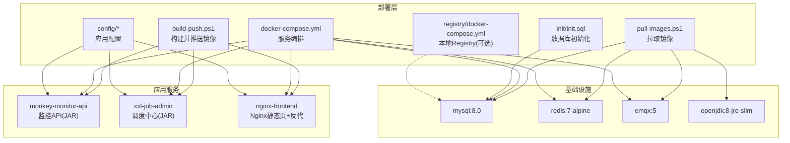
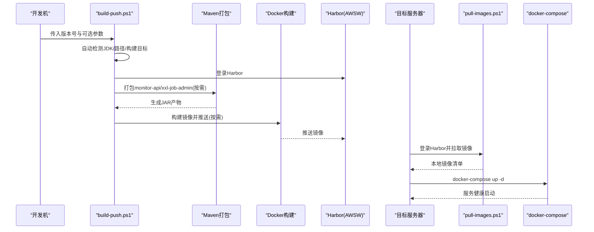
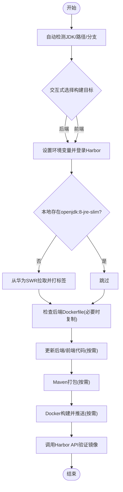
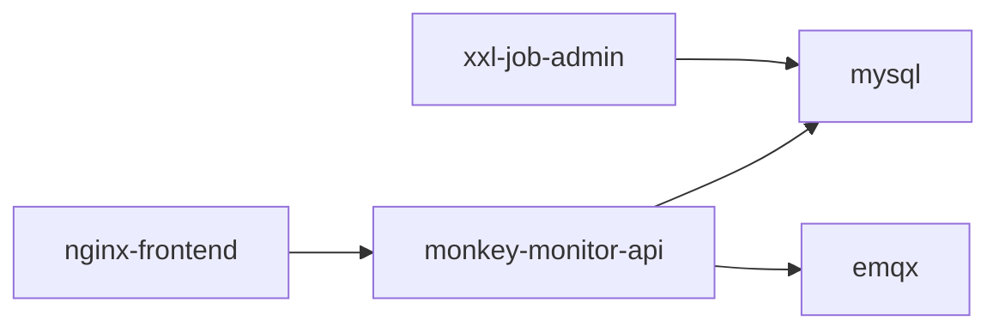

# 运维自动化

<cite>
**本文引用的文件**   
- [deploy/build-push.ps1](file://deploy/build-push.ps1)
- [deploy/pull-images.ps1](file://deploy/pull-images.ps1)
- [deploy/docker-compose.yml](file://deploy/docker-compose.yml)
- [deploy/registry/docker-compose.yml](file://deploy/registry/docker-compose.yml)
- [deploy/config/monitor-api/application-prod.yml](file://deploy/config/monitor-api/application-prod.yml)
- [deploy/config/xxl-job-admin/application-prod.properties](file://deploy/config/xxl-job-admin/application-prod.properties)
- [deploy/config/frontend/nginx.conf](file://deploy/config/frontend/nginx.conf)
- [deploy/init/init.sql](file://deploy/init/init.sql)
- [monkey-monitor-api/Dockerfile](file://monkey-monitor-api/Dockerfile)
- [xxl-job-admin/Dockerfile](file://xxl-job-admin/Dockerfile)
- [deploy/部署操作手册.md](file://deploy/部署操作手册.md)
- [monkey-monitor-api/src/main/resources/application-prod.yml](file://monkey-monitor-api/src/main/resources/application-prod.yml)
- [xxl-job-admin/src/main/resources/application-prod.properties](file://xxl-job-admin/src/main/resources/application-prod.properties)
</cite>

## 目录
1. [简介](#简介)
2. [项目结构](#项目结构)
3. [核心组件](#核心组件)
4. [架构总览](#架构总览)
5. [详细组件分析](#详细组件分析)
6. [依赖分析](#依赖分析)
7. [性能考虑](#性能考虑)
8. [故障排查指南](#故障排查指南)
9. [结论](#结论)
10. [附录](#附录)

## 简介
本文件面向安威 fireworks 物联网监控平台的运维与自动化，围绕 CI/CD 流水线、镜像构建与推送、自动化部署脚本、IaC（基础设施即代码）与配置管理、自动化测试与质量保障、运维任务自动化与监控、运维知识库与文档自动化、DevOps 最佳实践与团队协作流程，以及工具链选择与配置建议进行系统化说明。内容以仓库内的部署脚本、Compose 编排、配置文件与操作手册为依据，确保可落地、可复用。

## 项目结构
- 部署层（deploy/）
  - 自动化脚本：build-push.ps1（开发机构建并推送）、pull-images.ps1（目标机拉取镜像）
  - 编排与配置：docker-compose.yml、config/（应用配置）、init/（MySQL初始化脚本）、registry/（可选本地 Registry）
- 业务与调度模块
  - 后端 API：monkey-monitor-api（监控 API + JT808 服务）
  - 调度中心：xxl-job-admin（分布式任务调度）
  - 前端：nginx-frontend（静态资源 + 反向代理）
- 基础设施
  - MySQL、Redis、EMQX、OpenJDK（镜像由 Harbor 提供）

图表来源
- [deploy/docker-compose.yml:1-103](file://deploy/docker-compose.yml#L1-L103)
- [deploy/config/monitor-api/application-prod.yml:1-203](file://deploy/config/monitor-api/application-prod.yml#L1-L203)
- [deploy/config/xxl-job-admin/application-prod.properties:1-66](file://deploy/config/xxl-job-admin/application-prod.properties#L1-L66)
- [deploy/config/frontend/nginx.conf:1-24](file://deploy/config/frontend/nginx.conf#L1-L24)
- [deploy/init/init.sql:1-219](file://deploy/init/init.sql#L1-L219)
- [deploy/registry/docker-compose.yml:1-14](file://deploy/registry/docker-compose.yml#L1-L14)

章节来源
- [deploy/部署操作手册.md:1-280](file://deploy/部署操作手册.md#L1-L280)

## 核心组件
- 自动化构建与推送（开发机）
  - build-push.ps1：支持交互式选择构建目标（全部、仅后端、仅前端、仅 monitor-api、仅 xxl-job-admin），自动检测 JDK、后端/前端工程路径，拉取基础镜像 openjdk:8-jre-slim，执行 Maven 打包，构建并推送至 Harbor（ACR），最后校验镜像是否存在。
- 镜像拉取（目标服务器）
  - pull-images.ps1：登录 Harbor，批量拉取基础设施镜像与应用镜像，最终列出本地镜像清单。
- 服务编排与配置
  - docker-compose.yml：定义 mysql、redis、emqx、xxl-job-admin、monkey-monitor-api、nginx-frontend 六个服务，含健康检查、依赖顺序、端口映射、挂载卷与环境变量占位。
  - config/*：监控 API、调度中心与前端 Nginx 的生产配置文件。
  - init/init.sql：初始化数据库与调度任务表结构。
- 本地 Registry（可选）
  - registry/docker-compose.yml：启动本地 Docker Registry，便于离线部署或内网隔离场景。

章节来源
- [deploy/build-push.ps1:1-263](file://deploy/build-push.ps1#L1-L263)
- [deploy/pull-images.ps1:1-56](file://deploy/pull-images.ps1#L1-L56)
- [deploy/docker-compose.yml:1-103](file://deploy/docker-compose.yml#L1-L103)
- [deploy/config/monitor-api/application-prod.yml:1-203](file://deploy/config/monitor-api/application-prod.yml#L1-L203)
- [deploy/config/xxl-job-admin/application-prod.properties:1-66](file://deploy/config/xxl-job-admin/application-prod.properties#L1-L66)
- [deploy/config/frontend/nginx.conf:1-24](file://deploy/config/frontend/nginx.conf#L1-L24)
- [deploy/init/init.sql:1-219](file://deploy/init/init.sql#L1-L219)
- [deploy/registry/docker-compose.yml:1-14](file://deploy/registry/docker-compose.yml#L1-L14)

## 架构总览
整体采用“容器化 + 编排 + 私有镜像仓库”的方案，服务间通过 Docker 网络互通，应用配置通过挂载卷注入，数据持久化于宿主机 data/ 目录。部署流程分为“开发机构建 + 推送”和“目标机拉取 + 启动”两步，支持选择性更新。

图表来源
- [deploy/build-push.ps1:149-263](file://deploy/build-push.ps1#L149-L263)
- [deploy/pull-images.ps1:21-56](file://deploy/pull-images.ps1#L21-L56)
- [deploy/docker-compose.yml:1-103](file://deploy/docker-compose.yml#L1-L103)

## 详细组件分析

### 组件A：构建与推送脚本（build-push.ps1）
- 功能要点
  - 参数化：版本号必填，Harbor 地址、JDK、后端/前端工程路径、分支可选。
  - 路径自动检测：JAVA_HOME、PATH 中 java、常见安装目录；后端工程默认与项目根同级；前端工程在同级目录或广范围搜索。
  - 交互式构建目标：1~5 选择，按需跳过无关模块，提升效率。
  - 环境准备：设置 JAVA_HOME、PATH、关闭 DOCKER_BUILDKIT；登录 Harbor。
  - 基础镜像与 Dockerfile：若本地无 openjdk:8-jre-slim 则从华为 SWR 拉取并打标签；若后端模块缺少 Dockerfile 则从开发目录复制。
  - 代码更新：按分支切换并 git pull 后端/前端工程。
  - 打包与推送：Maven 打包选中模块，Docker build 并 push 至 Harbor。
  - 校验：调用 Harbor API 验证镜像存在。
- 参数与行为
  - -Version：必填，如 v1.0。
  - -ACR：Harbor 仓库前缀，默认 fireworks-local。
  - -JDK/-BackendDir/-FrontendDir/-BackendBranch/-FrontendBranch/-DevDir：均可覆盖自动检测。
- 错误处理
  - 任一步骤失败立即退出并输出错误信息，避免后续流程污染。

图表来源
- [deploy/build-push.ps1:149-263](file://deploy/build-push.ps1#L149-L263)

章节来源
- [deploy/build-push.ps1:1-263](file://deploy/build-push.ps1#L1-L263)
- [deploy/部署操作手册.md:48-113](file://deploy/部署操作手册.md#L48-L113)

### 组件B：镜像拉取脚本（pull-images.ps1）
- 功能要点
  - 登录 Harbor。
  - 拉取基础设施镜像：mysql:8.0、redis:7-alpine、emqx:5、nginx:alpine、openjdk:8-jre-slim。
  - 拉取应用镜像：monkey-monitor-api、xxl-job-admin、nginx-frontend，版本号来自 -Version。
  - 最终列出匹配的本地镜像，提示可执行 docker-compose up -d 启动。
- 使用建议
  - 与 .env 中版本号保持一致，避免版本漂移导致启动失败。

章节来源
- [deploy/pull-images.ps1:1-56](file://deploy/pull-images.ps1#L1-L56)
- [deploy/部署操作手册.md:116-134](file://deploy/部署操作手册.md#L116-L134)

### 组件C：服务编排与配置（docker-compose.yml）
- 服务与依赖
  - mysql、redis、emqx：基础设施，带健康检查。
  - xxl-job-admin：依赖 mysql 健康。
  - monkey-monitor-api：依赖 mysql、emqx 健康，暴露 9900、8383。
  - nginx-frontend：依赖 monitor-api，对外暴露 80。
- 配置注入
  - 监控 API：挂载 application-prod.yml，含数据库、Redis、MQTT、XXL-Job 等生产参数。
  - 调度中心：挂载 application-prod.properties，含数据库、连接池、邮件、令牌等。
  - 前端：挂载 nginx.conf，反向代理 /api/ 到 monitor-api:9900。
- 数据持久化
  - mysql、emqx 数据卷映射至 data/ 目录，避免容器删除丢失。

章节来源
- [deploy/docker-compose.yml:1-103](file://deploy/docker-compose.yml#L1-L103)
- [deploy/config/monitor-api/application-prod.yml:1-203](file://deploy/config/monitor-api/application-prod.yml#L1-L203)
- [deploy/config/xxl-job-admin/application-prod.properties:1-66](file://deploy/config/xxl-job-admin/application-prod.properties#L1-L66)
- [deploy/config/frontend/nginx.conf:1-24](file://deploy/config/frontend/nginx.conf#L1-L24)
- [deploy/init/init.sql:1-219](file://deploy/init/init.sql#L1-L219)

### 组件D：本地 Registry（可选）
- 用途
  - 在无法访问外网/内网 Harbor 的情况下，先在有网络的机器拉取镜像并导出，再在目标机导入并推送到本地 Registry，从而完成离线部署。
- 流程
  - 启动本地 Registry 容器。
  - 在有网络机器导出镜像 tar 包。
  - 目标机导入 tar 包并按需重新 tag 后 push 至本地 Registry。

章节来源
- [deploy/registry/docker-compose.yml:1-14](file://deploy/registry/docker-compose.yml#L1-L14)
- [deploy/部署操作手册.md:249-267](file://deploy/部署操作手册.md#L249-L267)

### 组件E：应用与容器镜像
- 监控 API（monkey-monitor-api）
  - Dockerfile：基于 openjdk:8-jre-slim，复制打包产物为 app.jar，暴露 9000/8383，以 prod 配置启动。
  - 生产配置：application-prod.yml（部署目录）与开发目录配置差异在于数据库与 MQTT 的 host/public-host，部署时应以部署目录为准。
- 调度中心（xxl-job-admin）
  - Dockerfile：基于 openjdk:8-jre-slim，复制打包产物为 app.jar，暴露 8989，以 prod 配置启动。
  - 生产配置：application-prod.properties（部署目录）与开发目录配置差异在于数据库 URL，部署时应以部署目录为准。

章节来源
- [monkey-monitor-api/Dockerfile:1-6](file://monkey-monitor-api/Dockerfile#L1-L6)
- [xxl-job-admin/Dockerfile:1-6](file://xxl-job-admin/Dockerfile#L1-L6)
- [deploy/config/monitor-api/application-prod.yml:1-203](file://deploy/config/monitor-api/application-prod.yml#L1-L203)
- [deploy/config/xxl-job-admin/application-prod.properties:1-66](file://deploy/config/xxl-job-admin/application-prod.properties#L1-L66)
- [monkey-monitor-api/src/main/resources/application-prod.yml:1-198](file://monkey-monitor-api/src/main/resources/application-prod.yml#L1-L198)
- [xxl-job-admin/src/main/resources/application-prod.properties:1-66](file://xxl-job-admin/src/main/resources/application-prod.properties#L1-L66)

## 依赖分析
- 服务依赖
  - nginx-frontend → monkey-monitor-api → mysql（healthy）、emqx（healthy）
  - xxl-job-admin → mysql（healthy）
- 配置依赖
  - 监控 API 的数据库、Redis、MQTT、XXL-Job 地址均通过挂载配置文件注入，需与 docker-compose.yml 中的服务名/端口一致。
- 镜像依赖
  - 后端模块依赖 openjdk:8-jre-slim；基础设施镜像来自 library 仓库；应用镜像来自 fireworks-local 仓库。

图表来源
- [deploy/docker-compose.yml:54-98](file://deploy/docker-compose.yml#L54-L98)

章节来源
- [deploy/docker-compose.yml:1-103](file://deploy/docker-compose.yml#L1-L103)

## 性能考虑
- 选择性构建：build-push.ps1 支持仅构建所需模块，减少 Maven 打包与 Docker 构建时间。
- 基础镜像复用：本地已有 openjdk:8-jre-slim 则跳过拉取，缩短构建时间。
- 健康检查：mysql、emqx 设置健康检查，降低应用启动失败概率。
- 连接池与超时：生产配置中数据库连接池与超时参数可根据业务压力调整。
- 日志与持久化：应用日志与数据库数据持久化至 data/，便于问题定位与灾备。

## 故障排查指南
- 构建阶段
  - JDK 检测失败：通过 -JDK 显式指定 JDK 路径；确保 PATH 中存在 java.exe。
  - 前端工程路径检测失败：通过 -FrontendDir 指定前端工程目录。
  - Maven 打包失败：检查后端工程依赖与网络，必要时在本地先行 mvn clean package。
  - Docker 构建失败：检查 Dockerfile 是否存在且与产物路径一致。
- 推送阶段
  - Harbor 登录失败：核对 Harbor 地址与凭据；确保网络可达。
  - 镜像不存在：确认推送成功并刷新 Harbor 页面或调用 Harbor API 校验。
- 拉取阶段
  - 拉取失败：检查网络与 Harbor 凭据；确认镜像版本号与 .env 一致。
- 启动阶段
  - 服务未健康：查看 docker-compose logs -f，关注 mysql、emqx 健康检查与应用启动日志。
  - 端口冲突：确认宿主机端口未被占用。
  - 配置不生效：确认挂载的配置文件路径与键值正确，尤其是数据库、MQTT、XXL-Job 地址。
- 离线部署
  - 本地 Registry：确认 registry 容器已启动，镜像已导入并重新 tag 后 push 成功。

章节来源
- [deploy/build-push.ps1:142-147](file://deploy/build-push.ps1#L142-L147)
- [deploy/pull-images.ps1:14-19](file://deploy/pull-images.ps1#L14-L19)
- [deploy/docker-compose.yml:17-22](file://deploy/docker-compose.yml#L17-L22)
- [deploy/部署操作手册.md:198-246](file://deploy/部署操作手册.md#L198-L246)

## 结论
通过 build-push.ps1 与 pull-images.ps1 的配合，结合 docker-compose.yml 的编排与 config/* 的配置注入，安威 fireworks 物联网监控平台实现了标准化、可选择性的自动化构建与部署流程。配合本地 Registry 可满足离线部署需求；通过健康检查与数据持久化提升了稳定性与可维护性。建议在持续集成中固化上述脚本与配置，形成可追溯、可审计的发布流水线。

## 附录

### CI/CD 流水线建议
- 触发条件
  - 后端/前端分支合并或打 Tag。
- 阶段划分
  - 代码检出 → 单元测试（可选）→ 构建（build-push.ps1，按需选择模块）→ 推送镜像 → 拉取镜像（目标机）→ 启动服务（docker-compose up -d）→ 健康检查与验证。
- 质量门禁
  - 代码扫描（SonarQube/SAST）、单元测试覆盖率阈值、Dockerfile 安全基线检查。
- 发布策略
  - 蓝绿/滚动发布（可选），结合版本号与健康检查回滚。

### 自动化测试与质量保证
- 单元测试：在 Maven 打包阶段执行（当前脚本跳过测试，可在 CI 中取消跳过）。
- 集成测试：在目标机拉取镜像后，执行接口测试与健康检查脚本。
- 安全扫描：镜像层扫描（Trivy/Clair），配置文件敏感信息脱敏。

### 运维任务自动化与监控
- 定时任务：利用 xxl-job-admin 管理调度，结合 init.sql 初始化任务。
- 日志采集：集中化日志收集（ELK/Fluentd），监控容器日志与业务指标。
- 健康检查：依赖 compose 的健康检查与外部探活脚本。

### 运维知识库与文档自动化
- 文档版本化：将部署手册与配置说明纳入 Git，随版本 Tag 发布。
- 变更记录：每次发版更新 .env 版本号与 init.sql，形成变更清单。
- 自动化文档：通过 CI 生成部署报告与镜像清单，归档至制品库。

### DevOps 最佳实践与团队协作
- 分支策略：主干保护、Feature Branch、Release 分支。
- 权限与密钥：Harbor 凭据、数据库密码、MQTT 凭据集中管理。
- 回滚策略：版本号与镜像标签解耦，快速回滚至上一个稳定版本。

### 运维自动化工具链选择与配置建议
- 构建与打包：Maven（CI 中缓存依赖）、Gradle（可选）。
- 镜像仓库：Harbor（私有），支持扫描与复制策略。
- 编排与编排：Docker Compose（本地/小规模）、Kubernetes（大规模）。
- 监控与日志：Prometheus/Grafana、ELK Stack。
- 安全：Trivy、SAST、Secrets 管理。
- 文档与知识库：Confluence/Notion + Git 钩子自动生成变更摘要。