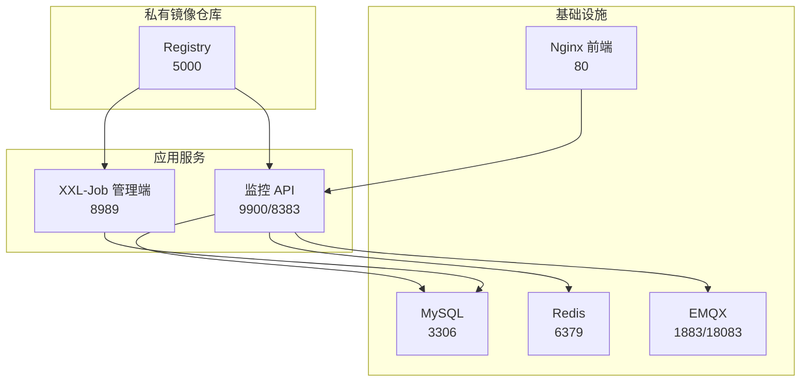
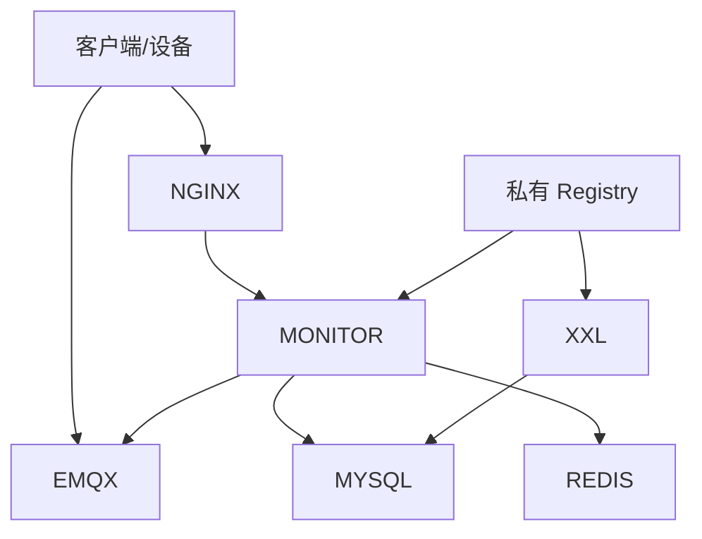
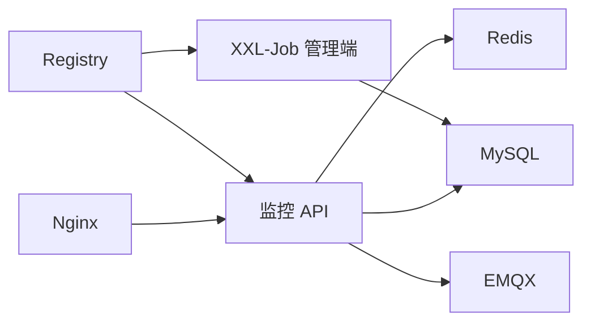

# 部署运维

<cite>
**本文引用的文件**
- [docker-compose.yml](file://deploy/docker-compose.yml)
- [application-prod.yml（监控API）](file://deploy/config/monitor-api/application-prod.yml)
- [application-prod.properties（调度中心）](file://deploy/config/xxl-job-admin/application-prod.properties)
- [init.sql](file://deploy/init/init.sql)
- [docker-compose.yml（镜像仓库）](file://deploy/registry/docker-compose.yml)
- [Dockerfile（监控API）](file://monkey-monitor-api/Dockerfile)
- [Dockerfile（调度中心）](file://xxl-job-admin/Dockerfile)
- [build-push.ps1](file://deploy/build-push.ps1)
- [pull-images.ps1](file://deploy/pull-images.ps1)
- [nginx.conf（前端）](file://deploy/config/frontend/nginx.conf)
- [application-prod.yml（监控API-本地）](file://monkey-monitor-api/src/main/resources/application-prod.yml)
- [logback-spring.xml（监控API）](file://monkey-monitor-api/src/main/resources/logback-spring.xml)
- [MQTTClient.java](file://monkey-monitor/src/main/java/com/monkey/general/config/mqtt/MQTTClient.java)
- [MqttConfiguration.java](file://monkey-monitor/src/main/java/com/monkey/general/config/MqttConfiguration.java)
- [MyMqttConfiguration.java](file://monkey-monitor/src/main/java/com/monkey/general/config/mqtt/MyMqttConfiguration.java)
- [MyDataSourceAutoConfiguration.java](file://monkey-monitor/src/main/java/com/monkey/general/config/MyDataSourceAutoConfiguration.java)
- [MonkeyMonitorApplication.java](file://monkey-monitor-api/src/main/java/com/monkey/general/MonkeyMonitorApplication.java)
</cite>

## 目录
1. [简介](#简介)
2. [项目结构](#项目结构)
3. [核心组件](#核心组件)
4. [架构总览](#架构总览)
5. [详细组件分析](#详细组件分析)
6. [依赖关系分析](#依赖关系分析)
7. [性能考虑](#性能考虑)
8. [故障排查指南](#故障排查指南)
9. [结论](#结论)
10. [附录](#附录)

## 简介
本文件面向安威 fireworks 物联网监控平台的生产环境部署与运维，覆盖以下内容：
- 多种部署方式：Docker 容器化与本地编排、私有镜像仓库、Kubernetes 集群部署建议
- 环境配置：数据库、缓存、MQTT、Nginx 前端、调度中心（XXL-Job）
- 监控告警：健康检查、性能指标、故障告警
- 日志管理：采集、存储、滚动与分析
- 性能调优：JVM 参数、数据库连接池、网络与MQTT参数
- 备份与恢复：数据库与配置备份策略
- 运维自动化：构建与拉取镜像脚本使用
- 常见问题排查：连接失败、健康检查不通过、日志异常

## 项目结构
平台由以下主要模块组成：
- 基础设施：MySQL、Redis、EMQX（MQTT）、Nginx（前端）
- 应用服务：监控 API、XXL-Job 调度中心
- 镜像仓库：私有 Harbor/Registry
- 配置与初始化：数据库初始化 SQL、各组件配置文件
- 运维脚本：构建与推送、镜像拉取

图表来源
- [docker-compose.yml:1-103](file://deploy/docker-compose.yml#L1-L103)
- [docker-compose.yml（镜像仓库）:1-14](file://deploy/registry/docker-compose.yml#L1-L14)

章节来源
- [docker-compose.yml:1-103](file://deploy/docker-compose.yml#L1-L103)
- [docker-compose.yml（镜像仓库）:1-14](file://deploy/registry/docker-compose.yml#L1-L14)

## 核心组件
- MySQL：主业务与调度中心数据库，初始化脚本包含调度任务表结构与示例任务
- Redis：缓存开关默认关闭，可按需启用
- EMQX：MQTT 服务，提供传感器与设备数据接入
- Nginx：前端静态资源与反向代理，转发 /api/ 到监控 API
- 监控 API：Spring Boot 应用，负责业务接口、MQTT 接收、定时任务调度
- XXL-Job 管理端：任务调度与执行器管理
- 私有 Registry：统一管理镜像版本与推送

章节来源
- [init.sql:1-219](file://deploy/init/init.sql#L1-L219)
- [application-prod.yml（监控API）:1-203](file://deploy/config/monitor-api/application-prod.yml#L1-L203)
- [application-prod.properties（调度中心）:1-66](file://deploy/config/xxl-job-admin/application-prod.properties#L1-L66)
- [nginx.conf（前端）:1-24](file://deploy/config/frontend/nginx.conf#L1-L24)

## 架构总览
下图展示容器化部署下的服务交互与端口映射：

图表来源
- [docker-compose.yml:1-103](file://deploy/docker-compose.yml#L1-L103)
- [application-prod.yml（监控API）:1-203](file://deploy/config/monitor-api/application-prod.yml#L1-L203)
- [application-prod.properties（调度中心）:1-66](file://deploy/config/xxl-job-admin/application-prod.properties#L1-L66)

## 详细组件分析

### 数据库配置（MySQL）
- 主业务库：anwei_mon_fireworks_local
- 调度库：xxl_job
- 初始化脚本包含调度任务表结构、示例任务与执行器注册记录
- 连接池：HikariCP，最小空闲与最大连接数在监控 API 配置中定义

章节来源
- [init.sql:1-219](file://deploy/init/init.sql#L1-L219)
- [application-prod.yml（监控API）:4-12](file://deploy/config/monitor-api/application-prod.yml#L4-L12)
- [application-prod.properties（调度中心）:25-41](file://deploy/config/xxl-job-admin/application-prod.properties#L25-L41)

### 缓存配置（Redis）
- 默认关闭缓存开关，可按需开启
- 连接超时、连接池大小等参数在配置中定义

章节来源
- [application-prod.yml（监控API）:14-26](file://deploy/config/monitor-api/application-prod.yml#L14-L26)

### MQTT 配置（EMQX）
- 监控 API 使用两个 MQTT 客户端：
  - 本地 MQTT：用于对外设备通信
  - 传感器 MQTT：用于接收传感器数据
- 客户端参数：用户名、密码、clientId、超时、保活
- 代码层提供 MQTT 客户端封装与连接选项配置

章节来源
- [application-prod.yml（监控API）:30-48](file://deploy/config/monitor-api/application-prod.yml#L30-L48)
- [MQTTClient.java:1-83](file://monkey-monitor/src/main/java/com/monkey/general/config/mqtt/MQTTClient.java#L1-L83)
- [MqttConfiguration.java:1-40](file://monkey-monitor/src/main/java/com/monkey/general/config/MqttConfiguration.java#L1-L40)
- [MyMqttConfiguration.java:1-43](file://monkey-monitor/src/main/java/com/monkey/general/config/mqtt/MyMqttConfiguration.java#L1-L43)

### Nginx 前端
- 提供静态资源与反向代理
- 将 /api/ 请求转发至监控 API 的 9900 端口
- 支持连接、读取、发送超时配置

章节来源
- [nginx.conf（前端）:1-24](file://deploy/config/frontend/nginx.conf#L1-L24)

### 监控 API 应用
- Spring Boot 启动类禁用 Headless 模式，支持集成大华 SDK 的图形界面能力
- 生产配置文件定义数据库、MQTT、Redis、XXL-Job 等参数
- 日志配置按环境输出到控制台与滚动文件

章节来源
- [MonkeyMonitorApplication.java:1-20](file://monkey-monitor-api/src/main/java/com/monkey/general/MonkeyMonitorApplication.java#L1-L20)
- [application-prod.yml（监控API-本地）:1-198](file://monkey-monitor-api/src/main/resources/application-prod.yml#L1-L198)
- [logback-spring.xml（监控API）:1-152](file://monkey-monitor-api/src/main/resources/logback-spring.xml#L1-L152)

### XXL-Job 调度中心
- 管理端端口 8989，连接 MySQL 调度库
- Hikari 连接池参数、触发线程池上限、日志保留天数等
- 与监控 API 的执行器（App Name）配合工作

章节来源
- [application-prod.properties（调度中心）:1-66](file://deploy/config/xxl-job-admin/application-prod.properties#L1-L66)
- [init.sql:1-219](file://deploy/init/init.sql#L1-L219)

### 私有镜像仓库
- Registry 服务，提供镜像存储与版本管理
- 本地可通过 5000 端口访问

章节来源
- [docker-compose.yml（镜像仓库）:1-14](file://deploy/registry/docker-compose.yml#L1-L14)

### 容器化与编排
- docker-compose 定义了 MySQL、Redis、EMQX、监控 API、XXL-Job 管理端、Nginx 前端
- 服务间通过自定义网络互通，健康检查保障启动顺序与可用性
- 监控 API 与 XXL-Job 管理端挂载配置与日志目录

章节来源
- [docker-compose.yml:1-103](file://deploy/docker-compose.yml#L1-L103)

### 构建与发布脚本
- build-push.ps1：自动检测 JDK、拉取/切换分支、Maven 打包、构建镜像并推送至私有仓库
- pull-images.ps1：登录私有仓库并拉取所需镜像

章节来源
- [build-push.ps1:1-263](file://deploy/build-push.ps1#L1-L263)
- [pull-images.ps1:1-56](file://deploy/pull-images.ps1#L1-L56)

## 依赖关系分析
- 监控 API 依赖 MySQL、Redis、EMQX，并通过 Nginx 对外暴露
- XXL-Job 管理端依赖 MySQL，与监控 API 的执行器协作
- 私有 Registry 为各服务镜像提供统一来源

图表来源
- [docker-compose.yml:1-103](file://deploy/docker-compose.yml#L1-L103)
- [application-prod.yml（监控API）:1-203](file://deploy/config/monitor-api/application-prod.yml#L1-L203)
- [application-prod.properties（调度中心）:1-66](file://deploy/config/xxl-job-admin/application-prod.properties#L1-L66)

## 性能考虑
- JVM 参数
  - 监控 API 使用 openjdk:8-jre-slim，建议在生产环境结合容器资源限制与 GC 参数进行调优（例如堆大小、GC 策略）
- 数据库连接池
  - HikariCP 最小空闲与最大连接数在监控 API 配置中定义，可根据并发与响应延迟调整
- 网络与 MQTT
  - MQTT 超时与保活参数影响连接稳定性，建议根据网络质量与设备数量适当增大
  - Nginx 的代理超时参数需与后端服务处理时间匹配
- 日志
  - 生产环境日志级别与滚动策略已在配置中定义，建议结合集中化日志系统（如 ELK/Fluentd）实现采集与检索

章节来源
- [Dockerfile（监控API）:1-6](file://monkey-monitor-api/Dockerfile#L1-L6)
- [application-prod.yml（监控API）:10-12](file://deploy/config/monitor-api/application-prod.yml#L10-L12)
- [application-prod.yml（监控API）:30-48](file://deploy/config/monitor-api/application-prod.yml#L30-L48)
- [nginx.conf（前端）:19-22](file://deploy/config/frontend/nginx.conf#L19-L22)
- [logback-spring.xml（监控API）:1-152](file://monkey-monitor-api/src/main/resources/logback-spring.xml#L1-L152)

## 故障排查指南
- 健康检查失败
  - MySQL/Redis/EMQX 的健康检查失败通常由初始脚本未完成或凭据错误导致，检查环境变量与初始化 SQL
- 服务启动顺序
  - docker-compose 中使用 depends_on 与健康检查，确保数据库先于应用启动
- MQTT 连接异常
  - 检查用户名、密码、clientId、超时与保活参数；确认 EMQX 端口映射与防火墙开放
- Nginx 反代失败
  - 确认 /api/ 路由指向监控 API 的 9900 端口，检查代理超时与后端可达性
- 日志异常
  - 生产环境日志输出到文件并按日期滚动，检查日志目录权限与磁盘空间

章节来源
- [docker-compose.yml:17-22](file://deploy/docker-compose.yml#L17-L22)
- [application-prod.yml（监控API）:30-48](file://deploy/config/monitor-api/application-prod.yml#L30-L48)
- [nginx.conf（前端）:12-22](file://deploy/config/frontend/nginx.conf#L12-L22)
- [logback-spring.xml（监控API）:30-99](file://monkey-monitor-api/src/main/resources/logback-spring.xml#L30-L99)

## 结论
通过私有镜像仓库与 docker-compose 编排，平台实现了基础设施与应用服务的一体化部署。结合完善的配置与健康检查机制，可在生产环境中稳定运行。建议进一步引入 Kubernetes 集群以提升弹性与可观测性，并完善集中化日志与告警体系。

## 附录

### 部署方式与步骤
- Docker 容器化与本地编排
  - 使用 docker-compose 启动全部服务，确保环境变量与挂载目录正确
  - 参考：[docker-compose.yml:1-103](file://deploy/docker-compose.yml#L1-L103)
- 私有镜像仓库
  - 启动 Registry 并推送/拉取镜像
  - 参考：[docker-compose.yml（镜像仓库）:1-14](file://deploy/registry/docker-compose.yml#L1-L14)
- 构建与推送
  - 使用 build-push.ps1 自动检测 JDK、拉取代码、打包并推送镜像
  - 参考：[build-push.ps1:1-263](file://deploy/build-push.ps1#L1-L263)
- 镜像拉取
  - 使用 pull-images.ps1 登录并拉取所需镜像
  - 参考：[pull-images.ps1:1-56](file://deploy/pull-images.ps1#L1-L56)

### 环境变量与配置要点
- 数据库与连接池
  - 参考：[application-prod.yml（监控API）:4-12](file://deploy/config/monitor-api/application-prod.yml#L4-L12)，[application-prod.properties（调度中心）:25-41](file://deploy/config/xxl-job-admin/application-prod.properties#L25-L41)
- 缓存与 MQTT
  - 参考：[application-prod.yml（监控API）:14-48](file://deploy/config/monitor-api/application-prod.yml#L14-L48)
- Nginx 反代
  - 参考：[nginx.conf（前端）:12-22](file://deploy/config/frontend/nginx.conf#L12-L22)
- 日志
  - 参考：[logback-spring.xml（监控API）:1-152](file://monkey-monitor-api/src/main/resources/logback-spring.xml#L1-L152)

### 监控与告警建议
- 健康检查
  - MySQL/Redis/EMQX 已内置健康检查，建议在编排层或监控系统中纳入告警
- 性能监控
  - 结合容器资源监控与应用指标（如 JVM、数据库连接池、MQTT 连接数）
- 故障告警
  - 建议基于日志与健康检查结果触发告警，并联动自动恢复流程

### 备份与恢复
- 数据库备份
  - 使用 mysqldump 或逻辑备份工具定期备份主业务库与调度库
- 配置备份
  - 备份 docker-compose.yml、各组件配置文件与初始化 SQL
- 恢复演练
  - 在隔离环境验证备份恢复流程，确保可快速回滚

### 运维自动化
- 构建与发布
  - 使用 build-push.ps1 统一构建与推送流程
- 镜像管理
  - 使用 pull-images.ps1 拉取镜像，避免手工操作遗漏