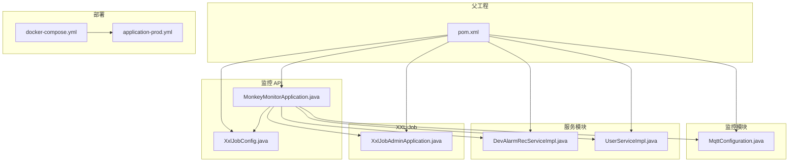
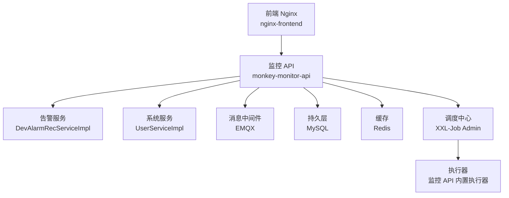
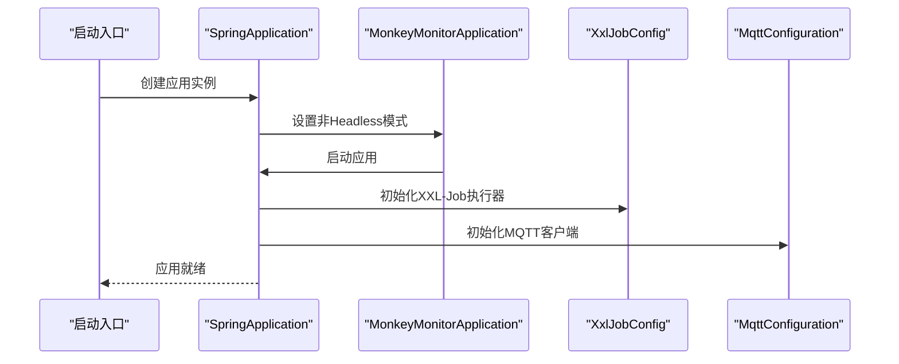
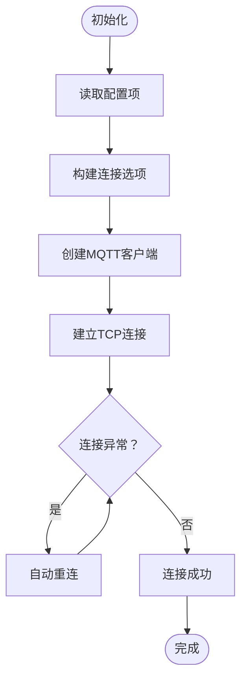
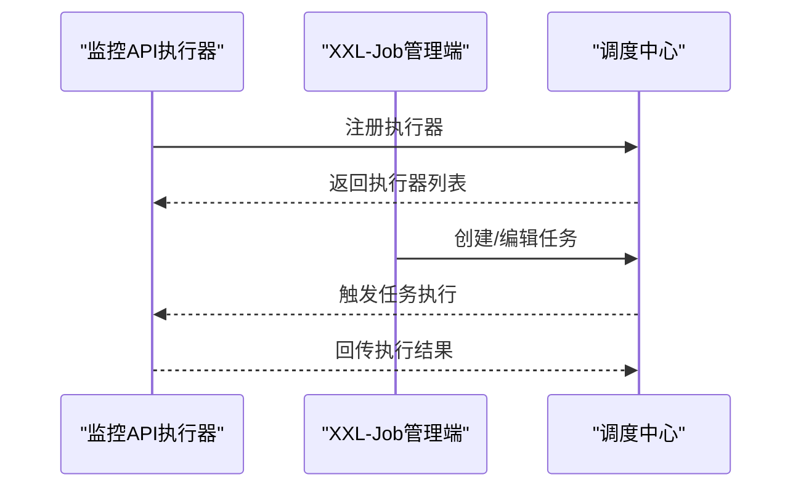
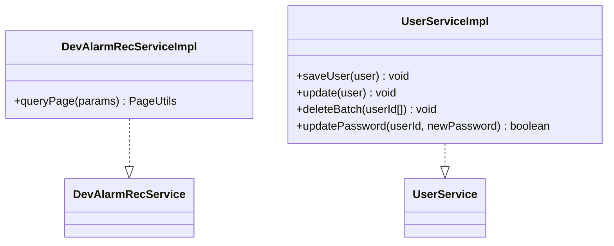
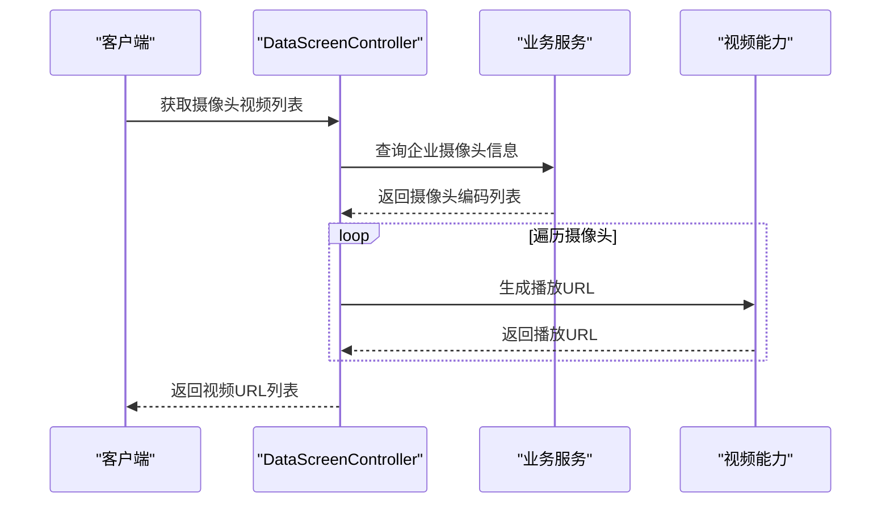
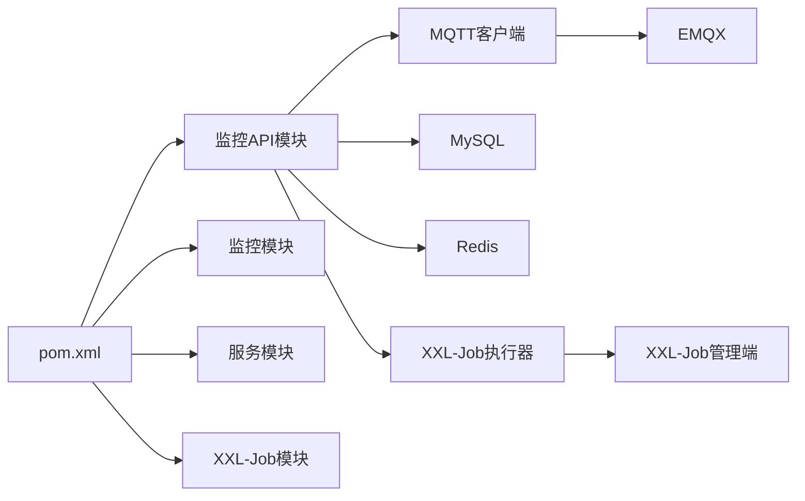
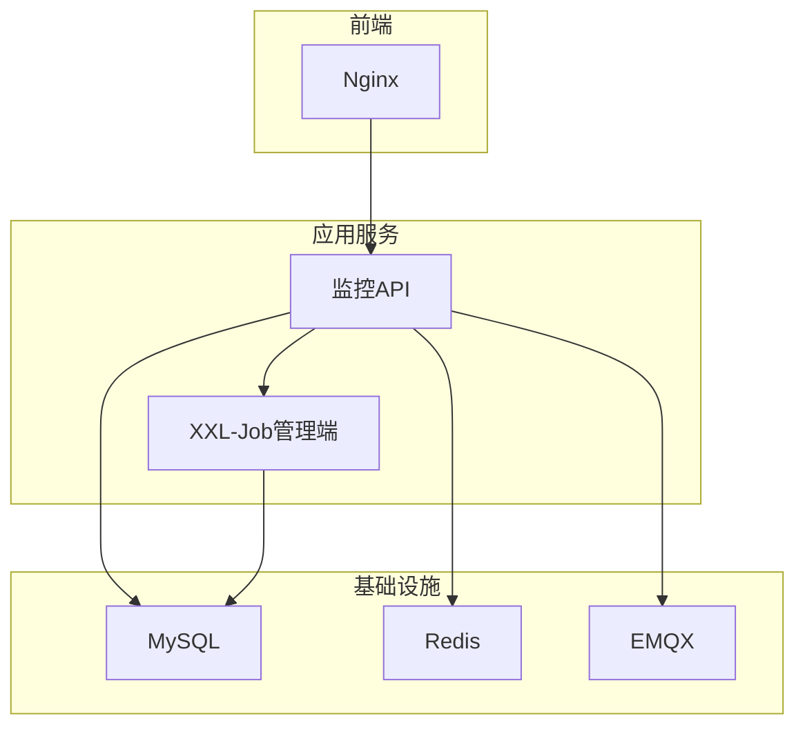

# 项目概述

<cite>
**本文引用的文件**
- [pom.xml](file://pom.xml)
- [docker-compose.yml](file://deploy/docker-compose.yml)
- [application-prod.yml](file://deploy/config/monitor-api/application-prod.yml)
- [MonkeyMonitorApplication.java](file://monkey-monitor-api/src/main/java/com/monkey/general/MonkeyMonitorApplication.java)
- [XxlJobAdminApplication.java](file://xxl-job-admin/src/main/java/com/xxl/job/admin/XxlJobAdminApplication.java)
- [MqttConfiguration.java](file://monkey-monitor/src/main/java/com/monkey/general/config/MqttConfiguration.java)
- [XxlJobConfig.java](file://monkey-monitor-api/src/main/java/com/monkey/general/config/XxlJobConfig.java)
- [DevAlarmRecServiceImpl.java](file://monkey-service/src/main/java/com/monkey/general/modules/em/service/Impl/DevAlarmRecServiceImpl.java)
- [UserServiceImpl.java](file://monkey-service/src/main/java/com/monkey/general/modules/sys/service/impl/UserServiceImpl.java)
- [DataScreenController.java](file://monkey-monitor-api/src/main/java/com/monkey/general/controller/DataScreenController.java)
</cite>

## 目录
1. [引言](#引言)
2. [项目结构](#项目结构)
3. [核心组件](#核心组件)
4. [架构总览](#架构总览)
5. [详细组件分析](#详细组件分析)
6. [依赖分析](#依赖分析)
7. [性能考虑](#性能考虑)
8. [故障排查指南](#故障排查指南)
9. [结论](#结论)
10. [附录](#附录)

## 引言
安威 fireworks 物联网监控平台是一个面向视频监控、设备管理与告警处理的综合型物联网平台。项目以微服务与模块化架构为核心，结合 Spring Boot、MyBatis Plus、MQTT 协议以及 XXL-Job 分布式调度，构建了覆盖设备接入、数据采集、算法告警、视频联动与大屏展示的完整链路。平台通过 Docker Compose 实现基础设施与应用服务的一键编排，具备良好的可扩展性与可运维性。

## 项目结构
项目采用 Maven 多模块聚合结构，核心模块包括：
- 父工程：统一版本与依赖管理
- 通用模块：公共配置、工具类、异常与校验
- 服务模块：业务领域模型与服务实现（设备、告警、系统用户等）
- 监控模块：MQTT 客户端、厂商 SDK 集成、Python 告警解析等
- 监控 API 模块：对外接口、定时任务执行器、Swagger 文档
- XXL-Job 管理端：分布式任务调度中心
- 部署配置：数据库、Redis、EMQX、Nginx 前端镜像与编排脚本

**图表来源**
- [pom.xml:11-16](file://pom.xml#L11-L16)
- [MonkeyMonitorApplication.java:1-20](file://monkey-monitor-api/src/main/java/com/monkey/general/MonkeyMonitorApplication.java#L1-L20)
- [MqttConfiguration.java:1-53](file://monkey-monitor/src/main/java/com/monkey/general/config/MqttConfiguration.java#L1-L53)
- [XxlJobConfig.java:1-78](file://monkey-monitor-api/src/main/java/com/monkey/general/config/XxlJobConfig.java#L1-L78)
- [DevAlarmRecServiceImpl.java:1-50](file://monkey-service/src/main/java/com/monkey/general/modules/em/service/Impl/DevAlarmRecServiceImpl.java#L1-L50)
- [UserServiceImpl.java:1-159](file://monkey-service/src/main/java/com/monkey/general/modules/sys/service/impl/UserServiceImpl.java#L1-L159)
- [XxlJobAdminApplication.java:1-16](file://xxl-job-admin/src/main/java/com/xxl/job/admin/XxlJobAdminApplication.java#L1-L16)
- [docker-compose.yml:1-103](file://deploy/docker-compose.yml#L1-L103)
- [application-prod.yml:1-203](file://deploy/config/monitor-api/application-prod.yml#L1-L203)

**章节来源**
- [pom.xml:11-16](file://pom.xml#L11-L16)
- [pom.xml:64-101](file://pom.xml#L64-L101)
- [docker-compose.yml:1-103](file://deploy/docker-compose.yml#L1-L103)

## 核心组件
- 监控 API 应用：Spring Boot 启动入口，支持禁用 Headless 模式以兼容本地图形处理场景，提供对外接口与定时任务执行器。
- MQTT 客户端配置：封装 EMQX 连接参数与客户端生命周期，支持自动重连与并发控制。
- XXL-Job 执行器：在监控 API 中注册执行器，连接调度中心，承载周期性数据同步与上传任务。
- 服务层实现：设备告警记录分页查询与系统用户管理，基于 MyBatis Plus 实现。
- 部署编排：MySQL、Redis、EMQX、XXL-Job 管理端、监控 API、前端 Nginx 通过 Docker Compose 编排，网络隔离与健康检查完备。

**章节来源**
- [MonkeyMonitorApplication.java:1-20](file://monkey-monitor-api/src/main/java/com/monkey/general/MonkeyMonitorApplication.java#L1-L20)
- [MqttConfiguration.java:1-53](file://monkey-monitor/src/main/java/com/monkey/general/config/MqttConfiguration.java#L1-L53)
- [XxlJobConfig.java:1-78](file://monkey-monitor-api/src/main/java/com/monkey/general/config/XxlJobConfig.java#L1-L78)
- [DevAlarmRecServiceImpl.java:1-50](file://monkey-service/src/main/java/com/monkey/general/modules/em/service/Impl/DevAlarmRecServiceImpl.java#L1-L50)
- [UserServiceImpl.java:1-159](file://monkey-service/src/main/java/com/monkey/general/modules/sys/service/impl/UserServiceImpl.java#L1-L159)
- [docker-compose.yml:1-103](file://deploy/docker-compose.yml#L1-L103)

## 架构总览
系统采用“前端 Nginx + 监控 API + 业务服务 + MQ(EMQX) + 数据库/缓存”的分层架构。监控 API 作为统一入口，负责设备接入、告警处理、视频联动与大屏展示；MQTT 用于设备与传感器数据的实时订阅；XXL-Job 负责定时任务的分布式调度；MySQL 存储业务数据，Redis 可按需启用缓存。

**图表来源**
- [docker-compose.yml:54-99](file://deploy/docker-compose.yml#L54-L99)
- [application-prod.yml:30-135](file://deploy/config/monitor-api/application-prod.yml#L30-L135)
- [XxlJobConfig.java:44-57](file://monkey-monitor-api/src/main/java/com/monkey/general/config/XxlJobConfig.java#L44-L57)

## 详细组件分析

### 组件一：监控 API 应用与启动流程
- 启动入口：通过注解与自定义启动类，显式设置非 Headless 模式，满足本地图形处理需求。
- 功能职责：对外提供设备、告警、人员统计、数据大屏等接口；集成 XXL-Job 执行器；加载 MQTT 客户端。

**图表来源**
- [MonkeyMonitorApplication.java:10-17](file://monkey-monitor-api/src/main/java/com/monkey/general/MonkeyMonitorApplication.java#L10-L17)
- [XxlJobConfig.java:44-57](file://monkey-monitor-api/src/main/java/com/monkey/general/config/XxlJobConfig.java#L44-L57)
- [MqttConfiguration.java:34-50](file://monkey-monitor/src/main/java/com/monkey/general/config/MqttConfiguration.java#L34-L50)

**章节来源**
- [MonkeyMonitorApplication.java:1-20](file://monkey-monitor-api/src/main/java/com/monkey/general/MonkeyMonitorApplication.java#L1-L20)
- [XxlJobConfig.java:1-78](file://monkey-monitor-api/src/main/java/com/monkey/general/config/XxlJobConfig.java#L1-L78)
- [MqttConfiguration.java:1-53](file://monkey-monitor/src/main/java/com/monkey/general/config/MqttConfiguration.java#L1-L53)

### 组件二：MQTT 客户端配置与连接策略
- 连接参数：主机、用户名、密码、客户端ID、超时与保活间隔。
- 连接选项：CleanSession、自动重连、并发上限控制。
- 生命周期：Bean 注册后即建立连接，日志记录连接状态。

**图表来源**
- [MqttConfiguration.java:20-50](file://monkey-monitor/src/main/java/com/monkey/general/config/MqttConfiguration.java#L20-L50)

**章节来源**
- [MqttConfiguration.java:1-53](file://monkey-monitor/src/main/java/com/monkey/general/config/MqttConfiguration.java#L1-L53)
- [application-prod.yml:30-48](file://deploy/config/monitor-api/application-prod.yml#L30-L48)

### 组件三：XXL-Job 执行器与调度中心
- 执行器配置：地址、令牌、应用名、IP/端口、日志路径与保留天数。
- 调度中心：通过管理端进行任务编排与执行器注册。
- 任务类型：周期性数据同步、离线数据上传等。

**图表来源**
- [XxlJobConfig.java:19-57](file://monkey-monitor-api/src/main/java/com/monkey/general/config/XxlJobConfig.java#L19-L57)
- [XxlJobAdminApplication.java:10-15](file://xxl-job-admin/src/main/java/com/xxl/job/admin/XxlJobAdminApplication.java#L10-L15)

**章节来源**
- [XxlJobConfig.java:1-78](file://monkey-monitor-api/src/main/java/com/monkey/general/config/XxlJobConfig.java#L1-L78)
- [XxlJobAdminApplication.java:1-16](file://xxl-job-admin/src/main/java/com/xxl/job/admin/XxlJobAdminApplication.java#L1-L16)
- [application-prod.yml:116-135](file://deploy/config/monitor-api/application-prod.yml#L116-L135)

### 组件四：告警与系统服务（服务层）
- 设备告警记录服务：支持多条件分页查询，涵盖设备编号、系统、类别、型号、时间范围与告警类型等。
- 系统用户服务：用户增删改查、角色权限校验、密码更新、菜单与权限查询等。

**图表来源**
- [DevAlarmRecServiceImpl.java:22-48](file://monkey-service/src/main/java/com/monkey/general/modules/em/service/Impl/DevAlarmRecServiceImpl.java#L22-L48)
- [UserServiceImpl.java:33-159](file://monkey-service/src/main/java/com/monkey/general/modules/sys/service/impl/UserServiceImpl.java#L33-L159)

**章节来源**
- [DevAlarmRecServiceImpl.java:1-50](file://monkey-service/src/main/java/com/monkey/general/modules/em/service/Impl/DevAlarmRecServiceImpl.java#L1-L50)
- [UserServiceImpl.java:1-159](file://monkey-service/src/main/java/com/monkey/general/modules/sys/service/impl/UserServiceImpl.java#L1-L159)

### 组件五：数据大屏与视频联动
- 数据大屏接口：根据企业摄像头信息生成视频播放地址，支持报警推送列表与配置时间窗口。
- 视频联动：结合设备通道与清晰度参数，调用海康等视频能力生成播放链接。

**图表来源**
- [DataScreenController.java:296-328](file://monkey-monitor-api/src/main/java/com/monkey/general/controller/DataScreenController.java#L296-L328)

**章节来源**
- [DataScreenController.java:296-328](file://monkey-monitor-api/src/main/java/com/monkey/general/controller/DataScreenController.java#L296-L328)

## 依赖分析
- 版本管理：父工程集中管理 Spring Boot、Spring Cloud、MyBatis Plus、MQTT 客户端、XXL-Job 等依赖版本。
- 模块耦合：监控 API 依赖监控模块（MQTT）、服务模块（业务服务）、XXL-Job 管理端；部署层通过 Docker Compose 解耦基础设施与应用。
- 外部依赖：MySQL、Redis、EMQX、Nginx 均通过容器化提供，便于横向扩展与替换。

**图表来源**
- [pom.xml:64-101](file://pom.xml#L64-L101)
- [docker-compose.yml:33-52](file://deploy/docker-compose.yml#L33-L52)

**章节来源**
- [pom.xml:64-101](file://pom.xml#L64-L101)
- [docker-compose.yml:1-103](file://deploy/docker-compose.yml#L1-L103)

## 性能考虑
- 连接池与并发：HikariCP 最大连接数与最小空闲连接配置，MQTT 并发上限与自动重连策略，有助于提升高并发下的稳定性。
- 缓存策略：Redis 开关可按需启用，避免不必要的缓存开销；建议对热点查询结果进行缓存。
- 定时任务：XXL-Job 执行器日志路径与保留天数配置，便于任务执行监控与资源回收。
- 图形处理：监控 API 启用非 Headless 模式，满足本地图像处理场景，但需评估 CPU/GPU 资源占用。

**章节来源**
- [application-prod.yml:10-26](file://deploy/config/monitor-api/application-prod.yml#L10-L26)
- [MqttConfiguration.java:42-44](file://monkey-monitor/src/main/java/com/monkey/general/config/MqttConfiguration.java#L42-L44)
- [XxlJobConfig.java:37-41](file://monkey-monitor-api/src/main/java/com/monkey/general/config/XxlJobConfig.java#L37-L41)
- [MonkeyMonitorApplication.java:13-16](file://monkey-monitor-api/src/main/java/com/monkey/general/MonkeyMonitorApplication.java#L13-L16)

## 故障排查指南
- MQTT 连接失败：检查 EMQX 服务健康状态、认证信息与客户端ID冲突；确认自动重连与并发上限配置。
- 数据库连接异常：核对 MySQL 容器健康检查与初始化脚本；确认连接池参数与账号权限。
- XXL-Job 任务未执行：确认执行器注册、调度中心地址与令牌配置；查看执行器日志路径与保留天数。
- 前端无法访问：检查 Nginx 映射端口与监控 API 健康状态；确认跨域与静态资源路径。
- 告警查询无结果：核对设备编号、时间范围与告警类型过滤条件；确认分页参数与索引使用情况。

**章节来源**
- [docker-compose.yml:17-23](file://deploy/docker-compose.yml#L17-L23)
- [application-prod.yml:30-48](file://deploy/config/monitor-api/application-prod.yml#L30-L48)
- [XxlJobConfig.java:48-55](file://monkey-monitor-api/src/main/java/com/monkey/general/config/XxlJobConfig.java#L48-L55)

## 结论
安威 fireworks 物联网监控平台通过模块化与微服务架构，实现了视频监控、设备管理与告警处理的统一平台化治理。依托 MQTT 实时数据接入、XXL-Job 分布式调度与容器化编排，平台具备良好的扩展性与可运维性。建议在生产环境中进一步完善缓存策略、监控指标与容灾备份，持续优化任务执行与数据一致性。

## 附录
- 部署拓扑图（概念示意）
